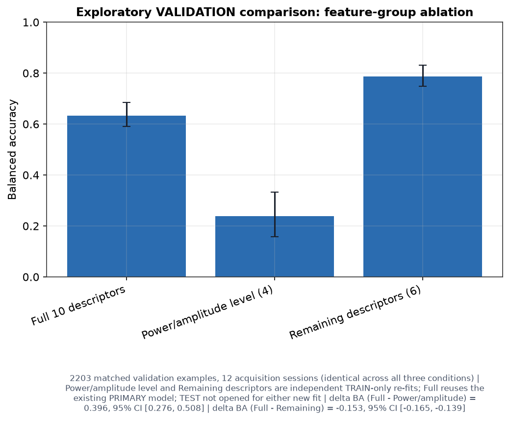
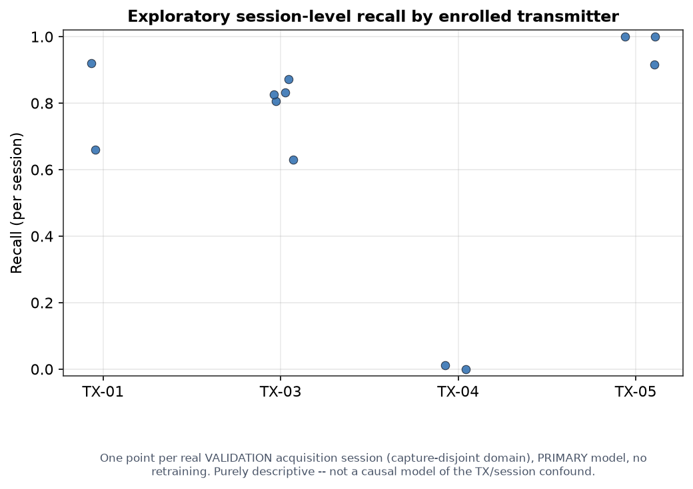

# RF-Fingerprint-Lab

**Software-defined radio research platform for RF acquisition, BLE
physical-layer device-identification research, signal analysis, and
experimental live inference.**

RF-Fingerprint-Lab combines a real **USRP B200** SDR acquisition path with a
browser-based research environment (**FastAPI** backend, **React/TypeScript**
frontend) built around one central research problem: given a known set of
enrolled BLE devices, which of them is most compatible with a later,
questioned RF emission?


---

## 1. What RF-Fingerprint-Lab is

RF-Fingerprint-Lab is an **active research platform**, not a finished
product claim. The authoritative state of any capability is its module
documentation, artifacts, tests, and scientific-status records — never
inferred only from the existence of a user-interface control. Two things sit
side by side in the same repository and must never be conflated:

- A **general-purpose SDR workspace** (spectrum/waterfall visualization,
  rule-based RF-object detection, demodulation, recordings) — the platform
  this project is built on top of.
- **BLE-RFFI Studio**, the research workflow this document is organized
  around: real USRP B200 acquisitions of BLE devices, a governed evidence
  pipeline, and a controlled RF-fingerprint (RFFI) comparison method.

## 2. Scientific problem

We have a limited set of physical BLE devices, previously **enrolled** —
recorded and characterized ahead of time under controlled conditions. Later,
a new RF emission appears. The practical question this project investigates
is:

**Which enrolled physical device is most compatible with this RF emission?**

**Context.** Known physical BLE devices can be recorded beforehand, under
controlled conditions.

**Problem.** A BLE advertising address is *logical* information — a value
the device's firmware reports. It is not, by itself, physical proof of
which radio actually generated the waveform: an attacker only needs to copy
that value into a different transmitter.

**Approach.** The USRP B200 preserves the actual RF waveform as raw I/Q
samples. Controlled reference examples are built from known, enrolled
devices; models are trained on those references; a later, questioned
emission is compared against the frozen enrolled set — never decided from
the advertised address alone.

```text
known devices -> enrollment -> B200 RF -> dataset -> training -> frozen model -> new emission -> comparison / inconclusive
```

Two different moments use the RF evidence differently, and the distinction
matters for the whole rest of this document.

**Enrollment** — building the reference:

```text
known device -> Windows/native BLE (independent logical observation)
             -> B200 captures real RF I/Q
             -> association / admission
             -> reference example
```

**Questioned-source comparison** — using the reference later:

```text
new RF emission -> B200
                 -> frozen preprocessing / frozen model
                 -> comparison against enrolled devices
                 -> result, or inconclusive
```

Windows/native BLE helps **build and check** the enrolled references during
enrollment. It is **not** supplied to the RF classifier as the answer during
later source comparison (full detail on exactly how bounded its role is:
§4.3). If the native Windows stack had to identify every future emission in
advance, the RF-fingerprint classifier would add little value on top of it —
the entire point of BLE-RFFI Studio is a comparison method that works from
radio evidence alone, once enrollment is done.

RF fingerprinting itself is established prior art, as are raw-I/Q CNN
fingerprinting, STFT/CNN2D fingerprinting, classical engineered-feature
classifiers, BLE-specific RF fingerprinting, and channel/power-cycle
sensitivity studies of RF fingerprints. RF-Fingerprint-Lab does not claim
novelty for any of those individual techniques. The more defensible
contribution is the **controlled integration**, in one real BLE
source-comparison pipeline over genuine USRP B200 acquisitions, of explicit
acquisition-dependence measurement (RQ1), a protected single-use future
evaluation (TRAIN -> VALIDATION -> FREEZE -> FUTURE TEST), radio-state
intervention (RQ3), BLE packet-content controls (RQ4), and end-to-end
evidence lineage — together, with real code and real tests, rather than any
one of them treated as a solved side detail. Terms this project deliberately
avoids as unqualified claims: *first*, *receiver-invariant*,
*channel-invariant*, *validated forensic attribution*, *validated real-time
identification*. Full positioning: [`docs/research/CONTRIBUTION.md`](docs/research/CONTRIBUTION.md).

---

## 3. Experimental architecture

Two structurally separate SDR subsystems exist in this codebase. Confusing
them produces wrong claims, so they are kept explicit everywhere in this
document:

| | BLE-RFFI capture path (produces the dataset below) | General spectrum-tools path (Live Monitor, RF Intelligence, demodulation) |
|---|---|---|
| SDR API | SoapySDR Python bindings, direct | GNU Radio's `uhd.usrp_source` block, direct |
| Device selection | `SoapySDR.Device({"driver":"uhd","serial":...})` | `gnuradio.uhd`, driver reported by the API as `uhd_gnuradio` |
| Entry point | `backend/tools/ble_sdr_capture_worker.py` | `backend/tools/spectrum_stream_worker.py` and siblings |
| Orchestration | `BleCaptureJobManager` -> `BleIqCaptureService` (subprocess, RadioConda Python) | `real_spectrum_stream.py` (persistent subprocess) |
| Exclusivity with the other path | Acquires a real, cross-process file lock (`SdrDeviceArbiter`) before opening the B200 | Does **not** check that lock — any exclusion between the two would come from the UHD driver refusing a second open on the same busy USB device, not from this codebase |

```text
UI -> FastAPI -> BleCaptureJobManager -> BleIqCaptureService
   -> ble_sdr_capture_worker.py -> SoapySDR -> driver="uhd" -> USRP B200
```

Real, campaign-persisted facts about this chain: UHD version `UHD
4.8.0.0-release` (observed, persisted per real capture); B200 serial
`E3R04Z1B2`; device identity confirmed via `device.getHardwareKey() ==
"B200"`. SoapySDR's own library/API/ABI version is **not** persisted for any
completed capture (computed only during device *probing*, never written
into a capture manifest — and on Windows the probe path itself is usually
bypassed by a `pnputil`-based enumeration shortcut). Full chain, per-layer
evidence, and the reproducibility table:
[`docs/ble/B200_ACQUISITION_CHAIN_TECHNICAL_AUDIT.md`](docs/ble/B200_ACQUISITION_CHAIN_TECHNICAL_AUDIT.md).

**Conventional BLE adapter (used alongside the B200, enrollment only).** A
Windows-default Bluetooth adapter — manufacturer/model/chipset/VID-PID are
**not documented** anywhere in the codebase, only "the OS-default adapter"
is ever queried. Stack: Bleak `0.22.3` on the WinRT backend. Its exact,
strictly bounded role (never an I/Q source, never a label source) is
detailed once, in full, in §4.3 — not repeated elsewhere in this document.
Full audit: [`docs/ble/BLE_ADAPTER_TECHNICAL_AUDIT.md`](docs/ble/BLE_ADAPTER_TECHNICAL_AUDIT.md).

---

## 4. BLE-RFFI acquisition and evidence path

```text
1. Capture RF I/Q (USRP B200, frozen acquisition profile)
2. Detect candidate bursts
3. Recover BLE packets and verify CRC
4. Associate packet evidence with an enrolled physical device (fail-closed policy, §4.3)
5. Create traceable examples tied to their exact source I/Q and sample range
6. Build capture-disjoint scientific partitions (TRAIN / VALIDATION / held-out same-campaign TEST)
7. Train -> validate -> freeze -> held-out same-campaign TEST -> (later) protected future confirmatory campaign
```

> **CRC-valid packet ≠ physical-source identity.** A correctly decoded
> packet proves the bits were received correctly. It does not, by itself,
> prove which enrolled physical device sent them — that is exactly what
> steps 4 and 7 exist to establish, separately and explicitly, never
> assumed from decode success alone.

### 4.1 Scientific preprocessing

**`base-v1`** (identity — no signal-altering step) is the preprocessing
profile actually used to produce every real result in this document. Two
other registered profiles exist in code but did **not** produce these
results:

- **`paper-eq6-7-v1`** — implemented but not used for the current results: a
  frozen BLE reference waveform `q[n]`, phase unwrapping over a frozen
  fitting interval (`preamble + access address`), a joint least-squares
  estimate of an affine phase/frequency offset, with per-burst provenance
  when it runs. A real, useful future ablation, not part of current
  evidence.
- **`offset-retaining-v1`** — the sensitivity-analysis counterpart to
  `paper-eq6-7-v1`. Because the real PRIMARY run already uses identity
  preprocessing, `offset-retaining-v1` resolves to the exact same (identity)
  configuration as `base-v1` for every real run to date — the two are
  behaviorally indistinguishable at the signal-processing level, so any
  equality between their reported balanced accuracies is a trivial
  consequence of that equivalence, not evidence that affine phase
  compensation leaves the result unchanged.

An older, simpler heuristic (`cfo-compensated-v1`) also exists for
historical/ablation utility, explicitly labeled **heuristic/legacy**. Full
derivation: [`docs/ble/PREPROCESSING.md`](docs/ble/PREPROCESSING.md).

The `cfo_estimate_hz` engineered feature (one of ten `engineered_rf`
descriptors) is a mean sample-to-sample phase-increment estimate over the
**whole**, unprocessed (`base-v1`) burst — best read as an *apparent mean
phase rate*, not a validated, isolated transmitter-CFO measurement: it can
mix GFSK modulation phase structure, true transmitter offset, and the B200
receiver's own local-oscillator offset. None of the other nine engineered
descriptors (power/amplitude statistics, spectral centroid/bandwidth, PAPR,
kurtosis, skewness) are calibrated estimators of a specific
transmitter-hardware impairment either — they are general statistics that
could in principle be influenced by such impairments, never presented as
isolating one.

### 4.2 Full evidence-lineage table

Every real stage, its input, output, real acceptance rule, real rejection
codes, and exact code reference:

| # | Stage | Input | Output | Real acceptance rule | Real rejection | Code |
|---|---|---|---|---|---|---|
| 1 | Acquisition | Frozen profile | Real `.sigmf-data` + manifest | Full sample count written, hash verified | `CAPTURE_SIZE_MISMATCH`, overflow/discontinuity codes | `ble_sdr_capture_worker.py` |
| 2 | Candidate burst detection | Full `.cf32` file | Candidate segments | `power > max(noise*4, noise+8*MAD, 1e-12)` | No active blocks -> 0 candidates | `detect_bursts()`, `ble_sdr_capture_worker.py:278-308` |
| 3 | Sync/timing recovery | One candidate segment | Selected sampling phase (of 16) | `sync_distance <= max_sync_errors(2)` vs. 40-bit preamble+AA | `timing_not_locked` | `timing_interpolator.py`, `dsp_receiver.py:104-112` |
| 4 | GFSK demod | Time-domain samples | Soft/hard bit stream | Deterministic discriminator | N/A | `dsp_receiver.py:56-59` |
| 5 | Dewhitening | Air bits + channel index | Dewhitened bits | Deterministic LFSR | N/A | `whitening.py:3-15` |
| 6 | PDU reconstruction | Dewhitened header+PDU bits | `BleDecodedPacket` | Preamble ≥7/8, AA Hamming distance 0, valid length | Rejected at whichever gate fails first | `bitstream_decoder.py:27-73` |
| 7 | CRC-24 check | PDU bits + received CRC | `crc_received == crc_computed` | Exact match | CRC mismatch -> packet dropped | `crc.py:3-15` |
| 8 | Native BLE / SDR association (auxiliary) | Decoded packet + native rows within ±250 ms | `association_strength` | See §4.3 | See §4.3 | `_associate()`, `ble_offline_replay.py:923-1047` |
| 9 | Evidence Stage resolution | Decoded packet address + Physical Device Registry | `physical_unit_id` + `LabelDecision` | Registry binding, or operator-declared physical isolation | `QUARANTINED` on a declared-off contradiction | `evidence_stage.py:90-160` |
| 10 | Dataset freeze | Selected `ExampleRecord`s | Frozen `DatasetManifest` | Deterministic composition hash, quality gate `ACCEPTED_FOR_TRAINING` | `NOT_ACCEPTED_FOR_TRAINING` | `dataset/dataset_builder.py` |
| 11 | Split | Frozen dataset | TRAIN/VALIDATION/TEST | No leakage on capture/execution/session/candidate/packet/sample-range | `NOT_FEASIBLE` | `split_builder.py` |
| 12 | Training | Split + `model_type` | `TrainingRun` + weights | Converges without exception | `FAILED` | `training_service.py` |
| 13 | VALIDATION scoring/selection | All trained candidates | One recommended model | `0.5*macro_f1 + 0.3*balanced_accuracy_proxy - unknown_capability_penalty` | N/A | `model_selector.py:37-68` |
| 14 | Held-out same-campaign TEST evaluation | Recommended (always) + opt-in others | `evaluation_report.json` | Honest provenance recorded | N/A | `evaluator.py` |
| 15 | Export/approval | Trained model + all required files | `ModelBundleManifest` | All 16 `REQUIRED_BUNDLE_FILES` present and hashed | `REJECTED` / `TEST_NOT_EXECUTED` | `contracts/bundle.py:26` |

Linking IDs that let any model score be traced back to raw IQ: `iq_sha256`
(capture) -> `candidate_id` -> `packet_id`/`packet_sha256` -> `example_id`
-> `dataset_manifest_sha256` -> `split_manifest_sha256` -> `training_run_id`
-> `bundle_id`. Full mechanism, every ID, every real count:
[`docs/ble/SCIENTIFIC_STATUS.md`](docs/ble/SCIENTIFIC_STATUS.md).

### 4.3 Native BLE / B200 association — auxiliary corroboration only, never a label source

A conventional Windows Bluetooth adapter runs alongside the B200 during
enrollment, purely as an auxiliary logical observation, with a strictly
bounded role:

- It never supplies I/Q — the B200 is the only RF evidence source used for
  training/evaluation.
- Its RSSI is diagnostic only, never one of the ten engineered RFFI
  features.
- Its host-side timestamps are generated at Python-callback time, not at RF
  reception time.
- **There is no RF-level or hardware-clock synchronization with the B200**
  — no PPS, no GPS, no shared trigger. The only link is host-clock proximity
  plus a **±250 ms candidate-search tolerance window**, used purely to
  narrow which native BLE observation *might* correspond to a decoded SDR
  packet. This is a candidate-matching parameter, not a timing-
  synchronization bound.

**Calibration attempt, real and current.** The full threshold grid
`50-500 ms` was swept for a STRONG-match criterion (`≥0.95` coverage).
Result: `NO_THRESHOLD_SATISFIES_CRITERIA` — `0.0` coverage and `0`
false-strong matches at every single threshold in the grid. The real corpus
currently contains **0 STRONG** native/SDR associations across all five
registered units. Among the 9,891 labeled examples in the current corpus,
**28 resolve to `association_status = AMBIGUOUS`** (0.28%); the remainder
splits between `PHYSICAL_ISOLATION_DECLARED` (4,338, 43.9%) and
pre-registered address-binding with no independent match (5,525 `NONE`, plus
the 28 `AMBIGUOUS`, together the 5,553-example address-bound cohort).

**This auxiliary mechanism does not generate the classifier's
training/evaluation labels.** `physical_unit_id` — the field every real
`class_distribution` is built from — is resolved independently by the
Evidence Stage's own registry binding (declared physical isolation, or
pre-registered address binding), never from the STRONG/WEAK/NONE native-
BLE/SDR association value. A dataset can, and in practice does, contain
real, non-`STRONG` examples. Consequently: `CRC-valid packet ≠
physical-source identity`, and `native context ≠ STRONG association`. This
is a real, current negative result, not a criterion that was loosened to
get a pass. Full detail: [`docs/ble/SCIENTIFIC_STATUS.md`](docs/ble/SCIENTIFIC_STATUS.md)
§5, §9.

---

## 5. Dataset and provenance

Current real four-unit closed-set corpus: `CC2541SensorTag`,
`CC2650-UNIT-01`, `keyfobdemo 01`, `keyfobdemo 02` — V2-admitted,
session-disjoint, leakage check `PASSED`, **9,891 real examples across 79
real B200 captures**, `Shelly-Plug-01` excluded as a class, no background
pooled in as a fifth class.

### 5.1 Corpus composition by class

Computed directly from the real split manifest's `assignments`. The
independent experimental unit here is the capture/session, not the
individual example record — every unit×domain cell below has `n_captures ==
n_sessions` (1:1 pairing in this dataset).

| Physical unit | Domain | n_examples | n_captures / sessions |
|---|---|---:|---:|
| CC2541SensorTag | TRAIN | 447 | 5 |
| CC2541SensorTag | VALIDATION | 187 | 2 |
| CC2541SensorTag | TEST | 216 | 2 |
| CC2650-UNIT-01 | TRAIN | 522 | 7 |
| CC2650-UNIT-01 | VALIDATION | 166 | 3 |
| CC2650-UNIT-01 | TEST | 225 | 3 |
| keyfobdemo 01 | TRAIN | 1,743 | 14 |
| keyfobdemo 01 | VALIDATION | 1,690 | 5 |
| keyfobdemo 01 | TEST | 1,857 | 5 |
| keyfobdemo 02 | TRAIN | 849 | 8 |
| keyfobdemo 02 | VALIDATION | 160 | 2 |
| keyfobdemo 02 | TEST | 166 | 2 |
| **TOTAL** | **TRAIN** | **3,561** | **34** |
| **TOTAL** | **VALIDATION** | **2,203** | **12** |
| **TOTAL** | **TEST** | **2,464** | **12** |

Full table with n_sessions split out separately, and the same data live from
the platform itself: BLE Scientific Results Studio -> **Supporting Tables**
tab; source: [`docs/ble/SCIENTIFIC_STATUS.md`](docs/ble/SCIENTIFIC_STATUS.md) §19.3.

### 5.2 `keyfobdemo 01` / `keyfobdemo 02` — two distinct physical units of the same commercial model, per the experimenter's own declaration

Three separate layers must not be conflated here: what the experimenter
responsible for the campaign reports, what is persisted in artifacts, and
what has been independently verified from those artifacts. They answer
different questions and none of them contradicts another.

**Experimenter-reported fact.** The campaign lead responsible for enrolling
these two units reports that `keyfobdemo 01` and `keyfobdemo 02` are **two
distinct physical units of the same commercial device model**. This
document treats that as the real, declared ground truth about which
physical hardware was enrolled — captured independently (79 real captures
split across them, zero shared source-I/Q/capture/session/example
intervals) and not contradicted by anything below.

**Public documentary status** — what the persisted Physical Device Registry
records actually contain today
(`backend/.../ble_rffi_studio/registry/physical_units/keyfobdemo 0{1,2}.json`):

| Field | `keyfobdemo 01` | `keyfobdemo 02` | Documented? |
|---|---|---|---|
| `manufacturer` | `TI` | `TI` | Yes |
| `device_family` (operator-declared) | `TI sensortag` | `TI sensortag` | Yes, operator-declared |
| `model` (exact commercial SKU/identifier) | `null` | `null` | **Not documented in any persisted artifact** — the exact commercial model identifier was never entered into the registry |
| `same_model_confirmation` | `NOT_CONFIRMED` | `NOT_CONFIRMED` | Reflects that no independent, documented confirmation procedure for this registry field was ever completed and persisted (`same_model_confirmation_basis: null`) — **not** a finding that the two units are different models. Absence of a persisted artifact-level confirmation is not evidence against the experimenter-reported fact above, and this document does not retroactively mark this field `CONFIRMED` without a documented basis for doing so. |
| `internal_serial` | `null` | `null` | Not documented |

**Internal equivalence — not verified, a separate question from the
commercial-model identity above.** Hardware revision, firmware version,
exact radio/chip revision, internal configuration, and antenna/component
equivalence are not documented or independently checked for either unit.
This is narrower than "same commercial model": two units of the same
commercial model can still carry different firmware/hardware revisions
across manufacturing batches or over time, and this repository currently
has no evidence either way.

**Summary of how this document uses these three layers:** *two distinct
physical units of the same commercial device model* (the experimenter-
reported fact, used as-is) — with the exact commercial model identifier
itself absent from every persisted artifact, and hardware/firmware/
chip-revision/configuration equivalence neither documented nor
independently verified.

### 5.3 Label provenance

`association_status` breakdown across the 9,891 admitted labels (source:
`label_provenance_report()`, frozen snapshot at
[`docs/ble/evidence/label_provenance_and_composition_IDENTITY-c52850a953.json`](docs/ble/evidence/label_provenance_and_composition_IDENTITY-c52850a953.json)):

| `association_status` | Count | Fraction |
|---|---:|---:|
| `PHYSICAL_ISOLATION_DECLARED` | 4,338 | 43.86% |
| `NONE` (pre-registered address binding, no independent match) | 5,525 | 55.86% |
| `AMBIGUOUS` | 28 | 0.28% |
| `STRONG` | 0 | 0.0% |

**Development label admission ≠ independently corroborated source
association.** All 9,891 admitted labels are development label admissions
under the controlled-acquisition protocol — sufficient to run the
DEVELOPMENT benchmark below, but not equivalent to `STRONG` native-BLE/SDR
association (§4.3), for which the real corpus currently has 0 examples and
no accepted calibration threshold.

---

## 6. Scientific controls (RQ1–RQ4)

A classifier can score well on held-out data for reasons that have nothing
to do with recognizing real RF hardware characteristics. These four checks
each test one specific, easy alternative explanation.

### RQ1 — Acquisition dependence

**Does it still work on a new recording?**

```text
related capture -> independent capture -> protected future period
```

Tests whether apparent performance depended on incidental context shared
between TRAIN and TEST captures, rather than on the device's real RF
characteristics.

### RQ2 — Signal representation

**If every branch receives exactly the same admitted RF evidence, does how
we represent it change the result?**

```text
same admitted RF -> engineered features | raw I/Q | STFT time-frequency | coarse morphology
```

The same examples, the same partitions, four different representations —
see §6.1 for the four real branches.

### RQ3 — Radio-state intervention

**Does turning the transmitter off and back on change the fingerprint more
than simply leaving it running?**

```text
PRE -> RESET -> POST
PRE -> CONTINUOUS/CONTROL -> POST
```

`receiver_epoch` (identity + qualified acquisition profile + session
boundary) protects this pairing: a PRE/POST pair is invalidated whenever the
receiver's qualified state changed between the two captures.

> **Limitation, stated explicitly.** For historical data with no logged
> restart/reconnect event, the session boundary uses a >1 hour acquisition
> gap as a documented proxy — **not** direct physical evidence the B200 was
> actually restarted. [`docs/ble/SCIENTIFIC_STATUS.md`](docs/ble/SCIENTIFIC_STATUS.md) §16.4.

### RQ4 — Packet-content dependence

**Is the model learning RF characteristics, or exploiting easy-to-copy BLE
packet content?**

```text
full-burst | ADvA-excluded | pre-PDU
```

The ADvA-excluded region genuinely **removes** the AdvA (advertiser address)
sample range — spliced out, never replaced with a fixed zero block, so no
artificial, trivially learnable pattern is introduced. `pre-PDU` is:

```text
Preamble + Access Address | STOP
```

— stopping before the PDU header, so no packet payload content is present
at all in that variant.

### 6.1 Implemented BLE-RFFI benchmark

RQ2's four real, executable signal-analysis branches — the only ones
BLE-RFFI Studio trains:

| Representation | Model(s) |
|---|---|
| Engineered RF descriptors | Logistic Regression / SVM-RBF / Random Forest |
| Raw I/Q | CNN1D |
| Time-frequency (STFT) | CNN2D |
| Coarse time-frequency morphology | Frozen morphological baseline (nearest-centroid, no iterative training) |

No other signal-analysis branch is implemented, exposed, or planned. Ideas
beyond this table are tracked separately, explicitly not mixed with it, in
[`docs/research/TECHNIQUE_ROADMAP.md`](docs/research/TECHNIQUE_ROADMAP.md).

### 6.2 TEST vs. future confirmatory campaign — the distinction used consistently below

```text
TRAIN
  |
  v
VALIDATION
  |
  v
model / threshold selection
  |
  v
held-out same-campaign TEST      <- already executed, results in §7

--------------------------------------------------
future confirmatory campaign, after analytical freeze   <- NOT_YET_AVAILABLE, §9
--------------------------------------------------
```

The **held-out same-campaign TEST** used throughout §7 is a real, already-
executed, capture-disjoint held-out evaluation drawn from the same
acquisition campaign as TRAIN/VALIDATION. It is a genuinely held-out
partition (never seen during training or model selection) — but it is
**not** the separate, still-pending **future confirmatory campaign** that
would run under a frozen analytical protocol after a confirmatory freeze
ceremony. The frozen-protocol mechanism for that future campaign is real and
versioned; no protocol has been run through it yet (`NOT_YET_AVAILABLE`,
§9). These two are structurally different contract types
(`SplitManifest.TEST` vs. `HoldoutGroup.FUTURE_TEST`) everywhere in this
repository — zero real `FUTURE_TEST` assignments exist on disk today.

---

## 7. Current experimental results

Real four-unit closed-set DEVELOPMENT benchmark. Protected future evaluation
has not been acquired and the protocol freeze has not started (§9), so
every result below is DEVELOPMENT evidence, not a definitive/confirmatory
outcome. Evaluation unit for every row is `EXAMPLE_RECORD` (burst-level)
unless stated otherwise — a separate, real 10-second decision-window
evaluation exists too (§7.6), never conflated with this one.

### 7.1 RQ1 — acquisition dependence

| Evaluation domain | Balanced accuracy | 95% CI | n (examples / sessions) |
|---|---:|---:|---:|
| Capture-dependent (same capture, intentionally leakage-optimistic diagnostic) | 0.958 | [0.939, 0.975] | 1,790 / 34 |
| Capture-disjoint (VALIDATION) | 0.634 | [0.591, 0.685] | 2,203 / 12 |
| Held-out same-campaign TEST | 0.767 | — (no CI persisted for this domain) | 2,464 / 12 |

`delta_dependence = capture-dependent − capture-disjoint = +0.324`, 95% CI
`[0.269, 0.371]` — a class-stratified, session-clustered bootstrap (cluster
key = `session_id`; stratified by `physical_unit_id`; `n_resamples=2000`,
seed `12345`), the two domains resampled **independently** (no physical
pairing exists between them). A real, on-hardware measurement of exactly the
optimism RQ1 is designed to detect: a single-recording evaluation would have
overstated closed-set discrimination by roughly 32 balanced-accuracy points
relative to genuinely disjoint captures.


### 7.2 RQ2 — representation comparison

VALIDATION, same admitted groups across all four branches:

| Branch | Balanced accuracy | Macro-F1 |
|---|---:|---:|
| coarse_morphology | 0.277 | 0.128 |
| **engineered_rf (PRIMARY)** | **0.634** | **0.586** |
| raw_iq | 0.248 | 0.226 |
| stft | 0.537 | 0.498 |

`engineered_rf` (best of Logistic Regression / SVM-RBF / Random Forest,
selected on VALIDATION only) was selected PRIMARY here and independently in
all 4 per-unit auxiliary runs — a repeated finding. **Model-selection budget
is not equal across branches**: `engineered_rf` evaluated 3 candidate model
families on VALIDATION and kept the best; the other three branches each used
exactly 1 fixed configuration; none ran a hyperparameter search within its
own family. This is a comparison under a disclosed, unequal selection
procedure, not an equal-budget benchmark.


### 7.3 RQ4 — analytical-region control: full-burst vs. pre-PDU

A narrower, already-executed control, distinct from the RQ4 packet-condition
intervention (§9, not executed): restricting which samples of the **same,
already-acquired** VALIDATION burst are available to the model, without
changing what the transmitter sent. `pre-PDU` keeps only the preamble (8
bits) + access address (32 bits), ending strictly before the PDU header.
`full-burst` reuses the existing PRIMARY model and its already-persisted
predictions (no recomputation); `pre-PDU` is an **independent TRAIN-only
re-fit** (fresh `TrainOnlyScaler`, same frozen Random Forest configuration,
no hyperparameter search) evaluated only on pre-PDU VALIDATION. **TEST was
not opened for either arm** (`approval_status=TEST_NOT_EXECUTED`). Both arms
score the identical 2,203 VALIDATION `example_id`s, same order, same 12
sessions, same 4 classes. Marked `DEVELOPMENT_EXPLORATORY`: defined and run
after the RQ1/RQ2 results above had already been inspected (post-hoc, not
pre-registered).

| Region | BA | 95% CI | Macro-F1 | Accuracy | n (examples / sessions) |
|---|---:|---:|---:|---:|---:|
| full-burst | 0.634 | [0.591, 0.685] | 0.586 | 0.749 | 2,203 / 12 |
| pre-PDU | 0.556 | [0.503, 0.628] | 0.495 | 0.647 | 2,203 / 12 |

`delta BA (full-burst − pre-PDU) = 0.078`, 95% CI `[0.046, 0.100]` — a
genuinely matched, class-stratified, session-clustered bootstrap; no
confirmatory significance test is reported for this exploratory contrast.


Substantial closed-set discrimination remains under pre-PDU (well above the
four-class chance level of 0.25). **This does not isolate transmitter-
hardware effects** — propagation, receiver state, received power, and other
acquisition dependencies remain present in pre-PDU and are not separated
from any transmitter-specific contribution. The 0.634 -> 0.556 decrease is
itself the result: evidence that closed-set performance depends in part on
the analytical region available to the model, not an estimate of what
fraction of discrimination is attributable to packet content.

| Unit | Recall, full-burst | Recall, pre-PDU | Δ |
|---|---:|---:|---:|
| CC2541SensorTag | 0.781 | 0.679 | +0.102 |
| CC2650-UNIT-01 | 0.952 | 0.855 | +0.096 |
| keyfobdemo 01 | 0.796 | 0.683 | +0.113 |
| keyfobdemo 02 | 0.006 | 0.006 | +0.000 |

`keyfobdemo 02` recall is **0.006 (1/160) under both regions, unchanged**.
Under full-burst, 159/160 (99.4%) are misassigned to `keyfobdemo 01`, 0 to
either sensor-platform unit. Under pre-PDU, 157/160 (98.1%) go to
`keyfobdemo 01` and 2/160 (1.3%) to `CC2650-UNIT-01` — recall itself does
not change, where the misclassified examples land does.


Full provenance: `06_statistics/rq4_full_burst_vs_pre_pdu_exploratory_report.json`;
consolidated detail: [`docs/ble/TECHNICAL_EVIDENCE_AUDIT.md` §7](docs/ble/TECHNICAL_EVIDENCE_AUDIT.md#7-full_burst-vs-pre_pdu--full-consolidation).

### 7.4 Feature-group ablation (exploratory, post hoc)

A post-hoc, VALIDATION-only exploratory analysis over the same closed-set
corpus and the same frozen Random Forest configuration as PRIMARY,
examining how much of the model's performance comes from the four
power/amplitude-level engineered descriptors versus the remaining six.
**Not** a model-improvement or model-selection exercise: no tuning, no new
TRAIN/VALIDATION population, **TEST remained closed for both new fits**
(`approval_status=TEST_NOT_EXECUTED`), and neither new fit substitutes for
or changes the PRIMARY result — all 29 real files behind PRIMARY's training
run and bundle were SHA-256-hashed before and after this ablation and are
byte-identical. The six-descriptor group is called **"remaining
descriptors"** below, not "non-power features" — PAPR, kurtosis, and
skewness are still amplitude-envelope statistics, not something structurally
unrelated to power.

| Condition | BA | 95% CI | Macro-F1 | Accuracy | n (examples / sessions) |
|---|---:|---:|---:|---:|---:|
| Full 10 descriptors (= PRIMARY, reused) | 0.634 | [0.591, 0.685] | 0.586 | 0.749 | 2,203 / 12 |
| Power/amplitude descriptors (4) | 0.238 | [0.158, 0.333] | 0.255 | 0.430 | 2,203 / 12 |
| Remaining descriptors (6) | 0.787 | [0.749, 0.831] | 0.516 | 0.550 | 2,203 / 12 |

`delta BA (Full − Power/amplitude) = +0.396`, 95% CI `[0.276, 0.508]`;
`delta BA (Full − Remaining) = −0.153`, 95% CI `[−0.165, −0.139]` — matched,
class-stratified, session-clustered bootstrap (`n_resamples=2000`, seed
`12345`), all three conditions scoring the identical 2,203 VALIDATION
examples / 12 sessions.



**A higher BA under "Remaining descriptors" does not mean a better model.**
Balanced accuracy and ordinary accuracy respond very differently to how
per-class recall shifts across this naturally imbalanced VALIDATION split:

| Unit | n (VALIDATION) | Recall, Full | Recall, Remaining (6) |
|---|---:|---:|---:|
| keyfobdemo 01 | 1,690 (76.7% of VALIDATION) | 0.796 | 0.444 |
| keyfobdemo 02 | 160 (7.3% of VALIDATION) | 0.006 | 0.900 |
| CC2541SensorTag | 187 (8.5%) | 0.781 | 0.845 |
| CC2650-UNIT-01 | 166 (7.5%) | 0.952 | 0.958 |

`keyfobdemo 01` alone is 76.7% of VALIDATION. Balanced accuracy weights all
four classes equally regardless of size, so `keyfobdemo 02`'s recall jump
from 0.006 to 0.900 dominates the BA delta. Ordinary accuracy is dominated
by the largest class instead: `keyfobdemo 01`'s recall drop from 0.796 to
0.444 costs far more raw-example correctness than `keyfobdemo 02`'s gain
returns — exactly why accuracy under "Remaining descriptors" (0.550) is
*lower* than under "Full" (0.749) even though its BA is higher. Neither
metric alone tells the whole story on this split, which is precisely why
both are reported together everywhere in this document.

Full provenance (dataset/split hashes, model configuration, per-condition
confusion matrices, PRIMARY-untouched hash comparison, `TEST_NOT_EXECUTED`
gate for both new fits): `06_statistics/feature_group_ablation_exploratory_report.json`.

### 7.5 Session-stability (exploratory, descriptive)

Per-session recall for the PRIMARY model, one point per real VALIDATION
acquisition session — purely descriptive, not a causal model of the
transmitter/session confound (§8):



`keyfobdemo 02` (TX-04 in the figure's pseudonym labeling, §11) recall is
near 0 in every one of its sessions, not just on aggregate — consistent
with §7.3's finding that its misclassifications land almost entirely on
`keyfobdemo 01` regardless of analytical region.

### 7.6 Decision-window aggregation, confusion matrices, and secondary checks

- **10-second decision-window check** (`06_statistics/coverage_analysis_report.json`):
  `TRAIN=34`, `VALIDATION=12`, `TEST=12` real windows, all 4 classes
  represented in every partition. `VALIDATION`: `BA=0.750`,
  `accuracy=0.833` (10/12 argmax); `TEST`: `BA=0.875`, `accuracy=0.917`
  (11/12 argmax). **Operational coverage is `0.833` in both partitions, not
  `1.000`** — the acceptance threshold (`0.66`, calibrated on VALIDATION)
  rejects 2 of 12 windows in each partition as `UNKNOWN`.
- **Confusion matrices**, capture-disjoint VALIDATION vs. held-out
  same-campaign TEST (PRIMARY branch) — `CC2650-UNIT-01` is perfectly
  separated (recall 1.0) in both:

  
  
  

- **Per-unit TEST recall** (PRIMARY branch), reported individually because
  the aggregate balanced-accuracy number hides real per-source spread on
  this naturally imbalanced split:

  | Unit | Recall (TEST) |
  |---|---:|
  | CC2650-UNIT-01 | 1.000 |
  | keyfobdemo 01 | 0.837 |
  | CC2541SensorTag | 0.699 |
  | keyfobdemo 02 | 0.530 |

  

- **Risk-coverage curve** (TEST, PRIMARY branch) — the selective-prediction
  curve (El-Yaniv & Wiener, 2010) the platform's abstention mechanism is
  built on:

  

- **Seed variability** — PRIMARY re-trained under the platform's two other
  frozen seeds (`137`, `2024`, VALIDATION-only):

  

- **Enrolled-population class-exclusion sensitivity** — a post-hoc
  recomputation of aggregate VALIDATION BA from PRIMARY's own already-scored
  predictions, excluding one class's examples from the metric at a time (the
  model itself is **not retrained** — not leave-one-device-out
  cross-validation). Excluding `keyfobdemo 02` raises the remaining-class BA
  to 0.843 (`Δ=+0.209`); excluding any of the other three lowers it by
  0.049-0.106 — the aggregate score depends on the enrolled comparison
  population, not a population-independent measure of identifiability.
- **Computational cost** — real inference latency and serialized model size
  per RQ2 branch:

  

- **4 auxiliary per-unit TARGET_VS_BACKGROUND detectors** (not the closed-set
  result above): real per-unit `delta_dependence` ranges from −0.042 to
  +0.018, all substantially smaller than the closed-set effect (target-vs-
  background is an easier task with more redundant evidence per window):

  

- **Campaign timeline** — every study phase, colored by its real, current
  `execution_state`:

  

- **Forensic evidence lineage** — source I/Q -> burst -> PDU -> admitted
  example -> dataset -> split -> preprocessing -> model -> RQ1/RQ2 decision,
  with real IDs from the closed-set PRIMARY branch:

  

All figures above are generated straight from the platform's own real,
persisted evidence by
[`docs/ble/generate_evidence_figures.py`](docs/ble/generate_evidence_figures.py)
— never hand-drawn, never edited to change a number. Regenerate after any
new real result (`--verify` cross-checks every figure's source-artifact hash
without regenerating anything):

```powershell
cd backend
./.venv-validation/Scripts/python.exe ../docs/ble/generate_evidence_figures.py
```

Or from the platform itself: BLE Scientific Results Studio -> **Evidence
Dashboard** tab -> "Generar imagenes nuevas (README + notebook)". Either path
only writes files into the working tree — review the diff and
`git add`/`commit`/`push` yourself afterward. Same data, same plotting
functions, also available as a runnable notebook:
[`docs/ble/evidence_figures.ipynb`](docs/ble/evidence_figures.ipynb). Full
field-by-field sourcing, a canonical artifact inventory with SHA-256, and
two complete traceability chains (one VALIDATION prediction, one TEST
prediction, each traced back to a rehashed source I/Q file):
[`docs/ble/TECHNICAL_EVIDENCE_AUDIT.md`](docs/ble/TECHNICAL_EVIDENCE_AUDIT.md),
underlying small JSON artifacts published under
[`docs/ble/evidence/`](docs/ble/evidence/).

---

## 8. Real-time spectrum and device visualization

This platform separates three capabilities that are easy to conflate. Full
technical audit with file/line citations, latency table, and one real
documented failure case:
[`docs/ble/REAL_TIME_SPECTRUM_DEVICE_VISUALIZATION_AUDIT.md`](docs/ble/REAL_TIME_SPECTRUM_DEVICE_VISUALIZATION_AUDIT.md).

```text
B200 live RF (general spectrum subsystem, GNU Radio/uhd_gnuradio)
     |
     v
spectrum / waterfall (100 ms poll)
     |
     +--> RF Intelligence: rule-based band-profile matching (not ML, not BLE-RFFI)
     |    -> labeled box overlay on the spectrum trace, 1200 ms poll
     |
     +--> BLE-RFFI live-spectrum inference: real trained RFFI bundle
          -> energy-threshold burst (default) or Gate-2A.2-decoded burst (opt-in)
          -> real frequency-positioned confidence band overlay on the same spectrum, ~1500 ms poll
```

**A. RF Intelligence** (`/rf-intelligence`, and as a live overlay on Live
Monitor) — real, working, rule-based: candidate energy regions scored
against a static band-profile catalog (frequency range + expected bandwidth
+ SNR). A `"bluetooth_ble"` profile family exists, so it can flag "this
looks like it's in the BLE band" — that is a band-profile guess, **never** a
decoded packet and **never** an enrolled-device identification. Real
screenshots exist (§8.1) — both show broadcast-FM detections, not BLE.

**B. BLE-RFFI live-spectrum inference** (`BleRffiLiveModelPanel`, embedded
directly in the Live Monitor page) — genuinely more built than a first
glance suggests. It reuses Live Monitor's own already-open B200 stream
(GNU-Radio path, not the SoapySDR training-data path), runs a real exported
model bundle (`OfflineInferenceService.run_live()`) against a live-selected
burst window, and **does** draw a real, frequency-positioned colored band on
the spectrum canvas with a confidence percentage and device label —
exactly the kind of overlay a reader would picture from the description
"device detected on the spectrum." What keeps this from being a validated
capability:

- By default the classified window is a raw energy-threshold burst, **not**
  the CRC-validated, bit-aligned window every TRAIN/VALIDATION/TEST example
  was built from — a documented mismatch. An opt-in flag
  (`BLE_LIVE_DECODE_ENABLED`, off unless explicitly enabled) closes that
  specific gap using a decoder that is itself not yet frozen (381/384 on its
  own development sweep).
- **One real, human-operated hardware trial exists** (2026-07-30, full table
  in §8.1): with decode enabled and the target device's registered address
  correctly confirmed while it was genuinely transmitting, the classifier's
  confidence (0.97) was statistically indistinguishable from its confidence
  on a completely unrelated ambient BLE transmitter while the target device
  was OFF. Energy detection and address decoding tracked physical reality
  correctly; **the classifier did not discriminate the enrolled device**.
- No latency, throughput, or dropped-window measurement exists for this
  path; no automated test exercises it end to end; no result is persisted
  by default (each result does carry a real `timestamp_utc`, but nothing
  logs a running history of them).

**C. What does not exist**: a unified overlay merging (A) and (B) into one
hypothesis; a persisted, timestamped collection of live BLE-RFFI
predictions; any automated test of the live chain.

### 8.1 Status and evidence

| Capability | Status |
|---|---|
| RF Intelligence rule-based overlay on live spectrum | **IMPLEMENTED** — real, screenshotted |
| BLE-RFFI live-spectrum inference, real bundle + real on-spectrum confidence band | **IMPLEMENTED_BUT_NOT_EMPIRICALLY_CHARACTERIZED** for reliability at scale — and not simply "uncharacterized": one real trial already shows the classifier fails to discriminate the enrolled device from ambient BLE traffic |
| Persisted log of near-live BLE-RFFI predictions | **NOT_IMPLEMENTED** |
| Automated end-to-end test of the live chain | **NOT_IMPLEMENTED** |
| "Validated real-time RF device identification" | **NOT_IMPLEMENTED / not claimable** — this repository already avoids "real-time" for this capability, using **"online experimental inference"** or **"live-spectrum inference"** instead, and the one real trial available is a documented negative discrimination result |

Real screenshots — both of capability (A), neither of (B), since no
screenshot of the BLE-RFFI live overlay exists in this repository:


The one real evidence of capability (B) is a table of real, timestamped
device-state/decode/confidence values from a manual on/off/on/off test, not
a screenshot: [`backend/app/modules/ble_rffi_studio/README.md`](backend/app/modules/ble_rffi_studio/README.md)
("Real, live on/off/on/off test"). Full audit, every file/line citation, the
complete latency table, and what would be needed for a scientifically solid
real-time claim:
[`docs/ble/REAL_TIME_SPECTRUM_DEVICE_VISUALIZATION_AUDIT.md`](docs/ble/REAL_TIME_SPECTRUM_DEVICE_VISUALIZATION_AUDIT.md).

**Evidence-timestamp convention, adopted from this point forward.** Any
screenshot, recording, or generated artifact added to this repository as
scientific or platform evidence should carry an explicit UTC capture
timestamp — in the filename (e.g. `evidence_live_monitor_20260825T120000Z.png`)
or as adjacent caption text — rather than relying on the git commit date
alone, since a file can be re-committed without the underlying content being
freshly recaptured. Figures generated by
[`docs/ble/generate_evidence_figures.py`](docs/ble/generate_evidence_figures.py)
already carry a `generated_at` field in `paper_exports/figure_manifest.json`
for exactly this reason; this convention extends the same discipline to
manually captured screenshots, which have no equivalent today.

---

## 9. Scientific limitations

- **Session/transmitter confounding.** No current receiver session contains
  more than one enrolled transmitter (verified: 79/79 sessions are
  single-unit). Each transmitter is represented across multiple sessions, so
  transmitter identity and session are not mathematically identical
  variables — but the design lacks within-session multi-transmitter
  observations that would let transmitter effects be directly separated from
  session-specific receiver, propagation, noise, or environmental state.
  Applies to every result in §7, including RQ1's acquisition-dependence
  contrast and the RQ4/feature-group-ablation controls.
- **No calibrated per-burst SNR.** The acquisition profile records receiver
  gain, sample rate, bandwidth, and center frequency, but no per-burst SNR
  or received-power estimate is computed or persisted; `mean_power_dbfs` is
  a raw amplitude statistic, not a calibrated SNR measurement.
- **Same-model internal equivalence.** See §5.2 — `keyfobdemo 01`/`02` are
  two distinct physical units of the same commercial model per the
  experimenter's own declaration; the exact commercial model identifier is
  not documented in any artifact, and hardware/firmware/chip-revision/
  configuration equivalence is neither documented nor independently
  verified.
- **Protocol freeze.** The frozen analytical-contract mechanism is real and
  versioned, but no protocol has been run through the confirmatory freeze
  ceremony that would make protected-future access eligible (§6.2, §10).
- **Development label admission ≠ independently corroborated source
  association.** See §5.3/§4.3 — 0 real examples currently have `STRONG`
  native-BLE/SDR association.
- **Native BLE / B200 association.** See §4.3 for the complete, single
  authoritative treatment (timing sweep, ±250 ms candidate-search tolerance,
  0 STRONG, 28 AMBIGUOUS) — not repeated here.
- **RF acquisition profile, partial.** Receiver/SDR/channel/frequency/
  sample-rate/bandwidth/gain/duration are all real and fully sourced;
  antenna model, TX-RX distance/geometry, and environment/location have
  **no schema field at all** (structural, not a search failure).
- **BLE-RFFI live-spectrum inference.** See §8 for the complete treatment,
  including the one real documented discrimination failure — not repeated
  here.

Full detail behind each item, including the exact artifacts and computed
values: [`docs/ble/TECHNICAL_EVIDENCE_AUDIT.md`](docs/ble/TECHNICAL_EVIDENCE_AUDIT.md).

---

## 10. Pending experimental work

| Item | Mechanism | Real evidence / status |
|---|---|---|
| Protected future confirmatory campaign | Real, versioned freeze mechanism | `NOT_YET_AVAILABLE` — gated behind a protocol freeze that has not started |
| RQ3 radio-state intervention | Implemented, sample size frozen (80 pairs: 10 RESET + 10 CONTROL per unit, 4 units) | `PENDING` — 0 real captures carry RQ3 metadata, 0 valid empirical pairs exist |
| RQ4 packet-condition intervention (original vs. controlled variant) | Implemented eligibility check | `NOT_AVAILABLE: CONTROLLED_VARIANT_NOT_AVAILABLE` — 0/4 enrolled units eligible; distinct from the already-executed analytical-region control in §7.3 |
| CH37 -> CH38 transport measurement | Real CH38 RF data exists (1,663 admitted examples for the four enrolled units, deliberately excluded from the RQ1/RQ2/RQ4 channel-37-only split) | `NOT_AVAILABLE` for the transport result itself — no `channel_transport_report.json` yet |
| CH39 | — | **0** real CH39 captures for the four enrolled units (exactly 1 CH39 capture exists anywhere in the store, for an unrelated diagnostic unit) |
| Persisted near-live BLE-RFFI prediction collection | Live-check mechanism real and wired (§8) | `NOT_AVAILABLE` — no collection mechanism wired yet |
| BLE-RFFI live path empirical characterization | Live-check mechanism real and wired (§8) | One real manual trial only (§8.1); no latency/drop-rate/offline-agreement measurement |

A passing test suite is evidence the code does what its own tests assert —
it is never treated as scientific validation anywhere in this project.

---

## 11. Platform modules / UI

BLE-RFFI Studio is the platform's primary research workflow. The same
backend also hosts the general SDR/RF workspace it is built on (§3).

### Live Monitor -- `/spectrum`

Real-time RF workspace: SDR connection and stream controls, frequency,
span, sample-rate, gain, antenna, markers, visualization, the RF
Intelligence overlay, and the BLE-RFFI live-spectrum inference panel (§8).


<details>
<summary>Waterfall, RF Intelligence overlay, Spectrum Tools, legacy view</summary>


Spectrum Tools definitions and validation checks:
[`frontend/src/features/spectrum-tools/VALIDATION.md`](frontend/src/features/spectrum-tools/VALIDATION.md).

</details>

### Capture Lab -- `/capture`

Controlled acquisition of real complex I/Q: immediate capture, or triggered
burst capture with a bounded pre-trigger buffer. Every capture preserves
raw I/Q, acquisition configuration, timing, labels/split, quality metadata,
and a SHA-256 checksum.


<details>
<summary>Earlier Capture Lab signal-analysis interface</summary>


</details>

### Dataset Builder -- `/dataset-builder`

The governance gate between acquisition and model use: offline QC, label
and review-state management, experimental split control, and
duplicate/overlap safeguards before anything can enter training or
validation.


### BLE-RFFI Studio -- `/ble-rffi-studio`

The workflow this document is built around — capture, evidence, dataset,
split, training, decision windows, and live-spectrum inference (§8), over
real USRP B200 acquisitions. No dedicated UI screenshot is included in this
README yet; the module's own scope, findings, and real evidence are
documented in
[`backend/app/modules/ble_rffi_studio/README.md`](backend/app/modules/ble_rffi_studio/README.md)
and [`docs/ble/SCIENTIFIC_STATUS.md`](docs/ble/SCIENTIFIC_STATUS.md).

### BLE Scientific Results Studio -- `/ble-scientific-results`

Turns BLE-RFFI Studio's captures into the formal scientific record behind
§6-§7: strict association semantics (§4.3), an eligibility/diagnostics
split, protocol-deviation classification, and real time-based decision
windows. Its **Guided Validation** tab is a real, wired capture-first wizard
for non-experts (Live Timing Diagnostic, Reinforced Target-Absence Control)
— real runs so far are consistent with the 0 STRONG associations stated in
§4.3. Its **Evidence Dashboard** tab is a live, refreshable, in-platform
view of §7's results, RQ3's sample-size decision and campaign progress, and
RQ4's per-unit eligibility — reads the same persisted artifacts live, never
a snapshot, with bootstrap CI error bars, a raw/normalized confusion-matrix
toggle, real decision-window/capture counts per domain, and a `CURRENT TEST
EVIDENCE` label on risk-coverage (the confirmatory variant stays pending
until the future confirmatory campaign runs, §10). Its **Supporting Tables**
tab adds per-transmitter capture composition, per-partition windows/
captures/sessions for any real split, label provenance, and receiver-epoch
composition. Its **Scientific Completeness** tab renders one real, live
status per paper element (`AVAILABLE` / `PENDING_REAL_ACQUISITION` /
`BLOCKED` / `NOT_ELIGIBLE` / `PROTECTED`, with the real missing evidence) —
the in-platform mirror of [`PENDING_TO_CLOSE.md`](PENDING_TO_CLOSE.md). No
dedicated UI screenshot yet; detail:
[`docs/ble/SCIENTIFIC_STATUS.md`](docs/ble/SCIENTIFIC_STATUS.md).

### RF Intelligence -- `/rf-intelligence`

Rule/profile-based RF-object detection and cautious protocol hypotheses
(§8.A). Energy in a frequency region is never treated as proof that a
protocol has been decoded.


### Demodulation -- `/demodulation` and Live Demodulation -- `/live-demodulation`

Marker-selected or stored-acquisition demodulation (analog, digital, BLE,
IEEE 802.15.4, OOK/FSK, and experimental protocol pipelines), plus
continuous AM/FM/NFM/WFM audio recovery from the live stream. A signal is
never reported as successfully decoded merely because RF energy was
observed.


<details>
<summary>Live Demodulation</summary>


</details>

### Other views

Mission Control (`/`, operational dashboard), Spectrum Tools, RF Experiment
Lab (`/rf-experiment-lab`, the general-technique registry — E0/E1/E3/E5
implemented, see
[`docs/research/TECHNIQUE_ROADMAP.md`](docs/research/TECHNIQUE_ROADMAP.md)
for what is not), E6 Oracle-Style Lab (`/e6-oracle-style-lab`, a separate,
non-BLE classical-ML lab), RF Signal Understanding, Training/Retraining/
Validation/Inference/Models, Waterfall, Recordings, KiwiSDR Map, and
Settings are all real, working views of the same backend — module-by-module
detail: [`backend/README.md`](backend/README.md).

---

## 12. Reproducibility and technical documentation

```text
RF-Fingerprint-Lab
|
+-- frontend/    React / TypeScript / Vite -- operator views, spectrum visualization
+-- backend/     FastAPI -- SDR control, acquisition, dataset governance,
|                demodulation, RF fingerprinting, BLE-RFFI Studio, ML workflows
+-- backend/tools/  Two separate acquisition/DSP toolsets, kept explicit (see section 3):
|                    GNU Radio/UHD workers (general spectrum path) and
|                    SoapySDR/UHD workers (BLE-RFFI capture path: ble_sdr_capture_worker.py)
+-- docs/        scientific and technical documentation
+-- readme_img/  README figures
+-- start_unified.ps1
```

The **backend owns hardware-facing and scientific processing state**; the
frontend provides the operator workflow and visualization layer.

Every BLE-RFFI prediction traces back to its original I/Q (§4.2's full
lineage table). Metadata migrations (corrections to already-persisted
records — never to I/Q itself) are recorded in an append-only migration
ledger (`migration_id`, timestamps, old/new value, reason, tool). Entries
reconstructed after the fact are explicitly flagged
`RETROACTIVE_RECONSTRUCTION`. Full mechanism and real counts:
[`docs/ble/SCIENTIFIC_STATUS.md`](docs/ble/SCIENTIFIC_STATUS.md) §16.10.

### Documentation index

- [`PENDING_TO_CLOSE.md`](PENDING_TO_CLOSE.md) -- everything real still
  needed to fully close the platform and the paper: the confirmatory
  readiness gate, the RQ3 physical campaign, the future confirmatory
  evaluation, and the remaining paper-text updates. Start here for "what's
  left."
- [`docs/ble/SCIENTIFIC_STATUS.md`](docs/ble/SCIENTIFIC_STATUS.md) --
  current BLE scientific evidence, full capability status, and the complete
  evidence-to-decision trace (start here for technical depth).
- [`docs/ble/TECHNICAL_EVIDENCE_AUDIT.md`](docs/ble/TECHNICAL_EVIDENCE_AUDIT.md)
  -- field-by-field sourcing and traceability chains for every number in §7.
- [`docs/ble/B200_ACQUISITION_CHAIN_TECHNICAL_AUDIT.md`](docs/ble/B200_ACQUISITION_CHAIN_TECHNICAL_AUDIT.md)
  -- the real BLE-RFFI SoapySDR/UHD acquisition chain, per layer.
- [`docs/ble/BLE_ADAPTER_TECHNICAL_AUDIT.md`](docs/ble/BLE_ADAPTER_TECHNICAL_AUDIT.md)
  -- the conventional BLE adapter used alongside the B200.
- [`docs/ble/REAL_TIME_SPECTRUM_DEVICE_VISUALIZATION_AUDIT.md`](docs/ble/REAL_TIME_SPECTRUM_DEVICE_VISUALIZATION_AUDIT.md)
  -- §8's full technical audit.
- [`docs/ble/PREPROCESSING.md`](docs/ble/PREPROCESSING.md) -- the paper's
  Eq.(6)-(7) preprocessing, full derivation and per-burst provenance.
- [`docs/research/TECHNIQUE_ROADMAP.md`](docs/research/TECHNIQUE_ROADMAP.md)
  -- not-yet-implemented technique ideas, kept out of the executable
  benchmark.
- [`docs/research/CONTRIBUTION.md`](docs/research/CONTRIBUTION.md) --
  scientific contribution and prior-art positioning.
- [`backend/app/modules/ble_rffi_studio/README.md`](backend/app/modules/ble_rffi_studio/README.md)
  -- BLE-RFFI Studio module documentation: engineering obstacles, real
  findings, and implementation detail.
- [`docs/ble/PILOT_V1_LEGACY.md`](docs/ble/PILOT_V1_LEGACY.md) -- the
  superseded BLE Dataset Studio Pilot v1 baseline.
- [Backend documentation](backend/README.md) / [Backend setup](backend/README_SETUP.md)
  -- architecture, APIs, workers, hardware integration.
- [Frontend documentation](frontend/README.md)

### Quick start

```powershell
uhd_find_devices
uhd_usrp_probe
```

Then, from the repository root:

```powershell
powershell -ExecutionPolicy Bypass -File .\start_unified.ps1
```

Core operator path once both processes are running:

```text
Live Monitor -> Capture Lab -> BLE-RFFI Studio -> Dataset Builder -> Training / Evaluation -> Experimental inference
```

Manual setup and every environment variable: [Backend setup](backend/README_SETUP.md).

### Citation

For academic use or publication, record the software revision, hardware
configuration, dataset version, acquisition conditions, and the relevant
validation state (TEST vs. future confirmatory campaign, §6.2) alongside any
reported result. A root-level `CITATION.cff` and explicit software license
are recommended for a citable release.

---

## 13. Testing

```powershell
cd backend
python -m pytest app/tests/unit -q
```

```powershell
cd frontend
npm run build
```

Hardware-facing changes should additionally be tested against the actual
SDR path (device discovery, connect/stream, acquisition controls, capture,
dataset routing) — a passing unit-test suite alone is not evidence that a
hardware-dependent workflow has been validated over real RF input. As §8.1
and §10 record explicitly, the BLE-RFFI live-spectrum inference chain in
particular has **no automated test coverage today** — its only real
validation is the one manual hardware trial cited in §8.
