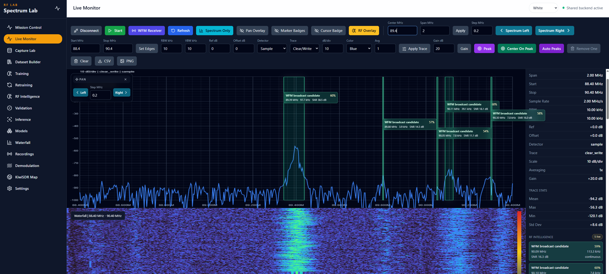
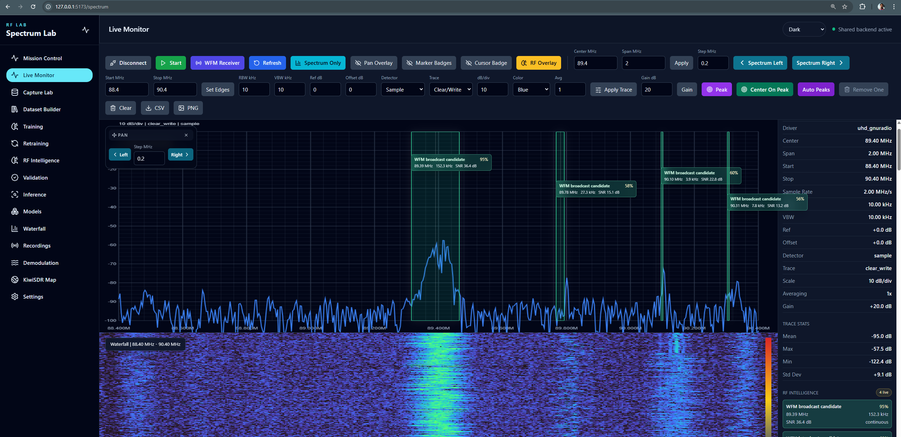
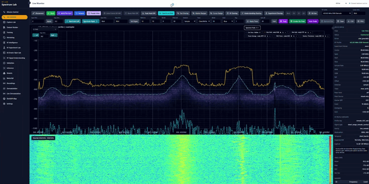
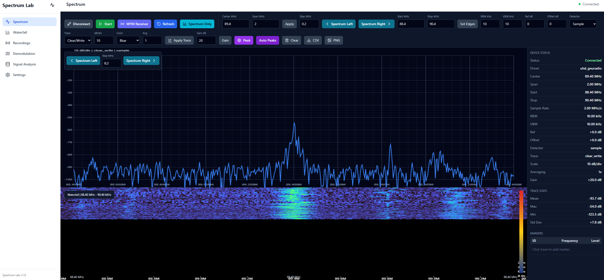
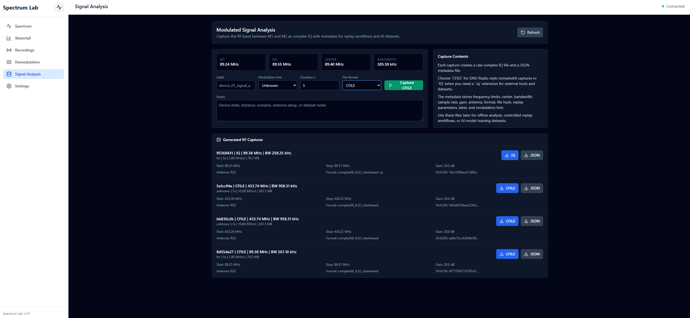
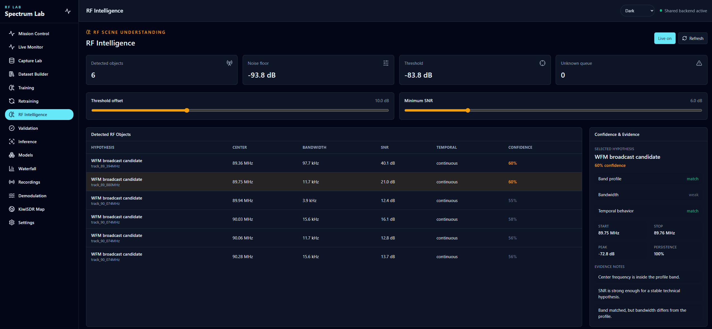

# RF-Fingerprint-Lab

**Software-defined radio research platform for RF acquisition, BLE
physical-layer device-identification research, signal analysis, and
experimental live inference.**

RF-Fingerprint-Lab combines a real **USRP B200** SDR acquisition path with a
browser-based research environment (**FastAPI** backend, **React/TypeScript**
frontend) built around one central research problem: given a known set of
enrolled BLE devices, which of them is most compatible with a later,
questioned RF emission?


---

## Start here: the practical problem

We have a limited set of physical BLE devices, previously **enrolled** —
recorded and characterized ahead of time under controlled conditions. Later,
a new RF emission appears. The practical question this project investigates
is:

**Which enrolled physical device is most compatible with this RF emission?**

**Context.** Known physical BLE devices can be recorded beforehand, under
controlled conditions.

**Problem.** A BLE advertising address is *logical* information — a value
the device's firmware reports. It is not, by itself, physical proof of
which radio actually generated the waveform: an attacker only needs to copy
that value into a different transmitter.

**Approach.** The USRP B200 preserves the actual RF waveform as raw I/Q
samples. Controlled reference examples are built from known, enrolled
devices; models are trained on those references; a later, questioned
emission is compared against the frozen enrolled set — never decided from
the advertised address alone.

```text
known devices -> enrollment -> B200 RF -> dataset -> training -> frozen model -> new emission -> comparison / inconclusive
```

## Why train a model?

Two different moments use the RF evidence differently, and the distinction
matters for the whole rest of this document.

**Enrollment** — building the reference:

```text
known device -> Windows/native BLE (independent logical observation)
             -> B200 captures real RF I/Q
             -> association / admission
             -> reference example
```

**Questioned-source comparison** — using the reference later:

```text
new RF emission -> B200
                 -> frozen preprocessing / frozen model
                 -> comparison against enrolled devices
                 -> result, or inconclusive
```

Windows/native BLE helps **build and check** the enrolled references during
enrollment. It is **not** supplied to the RF classifier as the answer during
later source comparison. If the native Windows stack had to identify every
future emission in advance, the RF-fingerprint classifier would add little
value on top of it — the entire point of BLE-RFFI Studio is a comparison
method that works from radio evidence alone, once enrollment is done.

## How the BLE-RFFI pipeline works

1. Capture RF I/Q (USRP B200, frozen acquisition profile).
2. Detect candidate bursts.
3. Recover BLE packets and verify CRC.
4. Associate packet evidence with an enrolled physical device, under a
   calibrated, **fail-closed** policy.
5. Create traceable examples tied to their exact source I/Q and sample
   range.
6. Build capture-disjoint scientific partitions (TRAIN / VALIDATION /
   protected FUTURE TEST).
7. Train -> validate -> freeze -> protected future evaluation / source
   comparison.

> **CRC-valid packet ≠ physical-source identity.** A correctly decoded
> packet proves the bits were received correctly. It does not, by itself,
> prove which enrolled physical device sent them — that is exactly what
> steps 4 and 7 exist to establish, separately and explicitly, never
> assumed from decode success alone.

---

## Four questions that keep a high score honest

A classifier can score well on held-out data for reasons that have nothing
to do with recognizing real RF hardware characteristics. These four checks
each test one specific, easy alternative explanation.

### RQ1 — Acquisition dependence

**Does it still work on a new recording?**

```text
related capture -> independent capture -> protected future period
```

Tests whether apparent performance depended on incidental context shared
between TRAIN and TEST captures (the same recording session, nearby-in-time
conditions), rather than on the device's real RF characteristics.

### RQ2 — Signal representation

**If every branch receives exactly the same admitted RF evidence, does how
we represent it change the result?**

```text
same admitted RF -> engineered features | raw I/Q | STFT time-frequency | coarse morphology
```

The same examples, the same partitions, four different representations —
see [Implemented benchmark](#implemented-ble-rffi-benchmark) below for the
four real branches this compares.

### RQ3 — Radio-state intervention

**Does turning the transmitter off and back on change the fingerprint more
than simply leaving it running?**

```text
PRE -> RESET -> POST
PRE -> CONTINUOUS/CONTROL -> POST
```

Separates a reset-associated displacement in the fingerprint from ordinary
PRE/POST drift that would happen anyway. `receiver_epoch` (identity +
qualified acquisition profile + session boundary) protects this pairing:
a PRE/POST pair is invalidated whenever the receiver's qualified state
changed between the two captures.

> **Limitation, stated explicitly.** For historical data with no logged
> restart/reconnect event, the session boundary uses a >1 hour acquisition
> gap as a documented proxy. This is **not** direct physical evidence that
> the B200 was actually restarted — see
> [`docs/ble/SCIENTIFIC_STATUS.md`](docs/ble/SCIENTIFIC_STATUS.md) §16.4.

### RQ4 — Packet-content dependence

**Is the model learning RF characteristics, or exploiting easy-to-copy BLE
packet content?**

```text
FULL_BURST | ADVA_EXCLUDED | PRE_PDU
```

`ADVA_EXCLUDED` genuinely **removes** the AdvA (advertiser address) sample
range from the analytical region — it is spliced out, never replaced with a
fixed zero block, so no artificial, trivially learnable pattern is
introduced in its place. `PRE_PDU` is:

```text
Preamble + Access Address | STOP
```

— stopping before the PDU header, so no packet payload content is present
at all in that variant.

---

## Implemented BLE-RFFI benchmark

RQ2's four real, executable signal-analysis branches — the only ones
BLE-RFFI Studio trains:

| Representation | Model(s) |
|---|---|
| Engineered RF descriptors | Logistic Regression / SVM-RBF / Random Forest |
| Raw I/Q | CNN1D |
| Time-frequency (STFT) | CNN2D |
| Coarse time-frequency morphology | Frozen morphological baseline (nearest-centroid, no iterative training) |

No other signal-analysis branch is implemented, exposed, or planned for
BLE-RFFI Studio. Ideas beyond this table (edge transformers, metric learning,
quantized inference, and similar) are tracked separately, explicitly not
mixed with the table above, in
[`docs/research/TECHNIQUE_ROADMAP.md`](docs/research/TECHNIQUE_ROADMAP.md).

### Scientific preprocessing

Two profiles matter for BLE-RFFI Studio's real scientific scope:

- **`paper-eq6-7-v1`** — the primary preprocessing: a frozen BLE reference
  waveform `q[n]`, phase unwrapping over a frozen fitting interval
  (`preamble + access address`), a joint least-squares estimate of an
  affine phase/frequency offset, and per-burst provenance persisted with
  every prediction.
- **`offset-retaining-v1`** — the matching sensitivity-analysis profile,
  identical pipeline, offset deliberately not compensated.

An older, simpler correction (`cfo-compensated-v1`) still exists for
historical/ablation utility. It is explicitly labeled **heuristic/legacy**
and must not be read as an implementation of the paper's compensation —
full derivation and the exact distinction:
[`docs/ble/PREPROCESSING.md`](docs/ble/PREPROCESSING.md).

---

## Current scientific status

**Implemented** = exists in code, wired into the real pipeline, has tests.
**Experimentally validated** = additionally exercised by the required real
campaign, with real evidence meeting its stated scientific criteria. The
second never follows automatically from the first anywhere in this project.

| Capability | Implemented | Real evidence / validation |
|---|---:|---|
| Real B200 I/Q capture | Yes | Yes |
| BLE packet recovery / CRC | Yes | Yes |
| Dataset + capture-disjoint leakage protection | Yes | Yes |
| TRAIN / VALIDATION / protected TEST mechanism | Yes | Mechanism tested; definitive campaign pending |
| `paper-eq6-7-v1` preprocessing (Eq. 6-7) | Yes | Unit/integration tested; no definitive real bundle yet |
| RQ1 acquisition-dependence measurement | Yes | **Executed** — real closed-set `delta_dependence = +0.2182` (see below) |
| Four RQ2 model branches | Yes | **Executed** — real closed-set benchmark, `engineered_rf` selected PRIMARY (see below) |
| Decision-window aggregation | Yes | Definitive campaign pending |
| Abstention / coverage / risk-coverage | Yes | Definitive campaign pending |
| PRE/POST RESET-CONTROL framework (RQ3) | Yes | Sample size frozen (80 pairs); 0 real pairs captured yet |
| FULL_BURST / ADVA_EXCLUDED / PRE_PDU (RQ4) | Yes | **0/4 enrolled units eligible** — `DATA_NOT_AVAILABLE`, real evidence recorded per unit (see below) |
| Strong native <-> SDR association | Mechanism yes | **No — 0 STRONG, no accepted calibration policy** |
| Protected future scientific result | Mechanism yes | **Not yet executed** |

A passing test suite is evidence the code does what its own tests assert —
it is never treated as scientific validation anywhere in this project.

**Association, stated plainly**: the association mechanism is implemented
and **fail-closed**
(`ScientificResultsRepository.find_frozen_association_policy()` currently
returns `None`). No calibration run has yet produced a policy that
satisfies the scientific acceptance criteria, and the real corpus currently
contains **0 STRONG** associations. Consequently: `CRC-valid packet ≠
physical-source identity`, and `native context ≠ STRONG association`. This
is a real, current negative result, not a criterion that was loosened to
get a pass.

Full current-state detail, every real number behind the table above, and
the complete evidence-to-decision trace live in
[`docs/ble/SCIENTIFIC_STATUS.md`](docs/ble/SCIENTIFIC_STATUS.md).

### Real closed-set benchmark result (2026-08-16)

First real, definitive run of the 4-unit closed-set comparison (`CC2541SensorTag`,
`CC2650-UNIT-01`, `keyfobdemo 01`, `keyfobdemo 02` — V2-admitted, session-disjoint,
leakage check `PASSED`, 9,891 real examples across 79 real B200 captures, Shelly excluded
as a class, no background pooled in as a fifth class):

| Evaluation domain (RQ1) | Balanced accuracy | n |
|---|---:|---:|
| `BA_window` (intentionally capture-dependent diagnostic) | 0.9676 | 1,790 |
| `BA_capture` (capture-disjoint, confirmatory) | 0.7494 | 2,203 |
| Held-out TEST (PRIMARY branch) | 0.7666 | 2,464 |

`delta_dependence = BA_window - BA_capture = +0.2182` — a real, on-hardware measurement
of exactly the optimism RQ1 is designed to detect: a single-recording evaluation would
have overstated closed-set discrimination by roughly 22 balanced-accuracy points relative
to genuinely disjoint captures.

RQ2 branch comparison (VALIDATION, same admitted groups):

| Branch | Balanced accuracy | Macro-F1 |
|---|---:|---:|
| coarse_morphology | 0.277 | 0.128 |
| **engineered_rf (PRIMARY)** | **0.634** | **0.586** |
| raw_iq | 0.248 | 0.226 |
| stft | 0.537 | 0.498 |

`engineered_rf` (best of Logistic Regression / SVM-RBF / Random Forest, selected on
VALIDATION only) was selected PRIMARY in this run and independently in all 4 per-unit
auxiliary runs below — a real, repeated finding, not a single cherry-picked outcome.

Per-unit TEST recall (PRIMARY branch), reported individually because the aggregate
balanced-accuracy number hides real, large per-source spread on this naturally imbalanced
split (TEST alone ranges from 166 to 1,857 examples per unit):

| Unit | Recall (TEST) |
|---|---:|
| CC2650-UNIT-01 | 1.000 |
| keyfobdemo 01 | 0.837 |
| CC2541SensorTag | 0.699 |
| keyfobdemo 02 | 0.530 |

4 auxiliary per-unit TARGET_VS_BACKGROUND detectors (not the closed-set result above)
were also run — real per-unit `delta_dependence` ranges from -0.046 to +0.070, all
substantially smaller than the closed-set effect above (target-vs-background is an
easier task with more redundant evidence per window; the multiclass task is where
acquisition dependence actually shows up).

**RQ3** — sample size frozen (`rq3_sample_size` scientist decision,
`PROSPECTIVE_BALANCED_WITHIN_DEVICE_CROSSOVER`): 10 RESET + 10 CONTROL pairs per unit,
80 pairs / 160 captures total across the 4 units. 0 real pairs captured yet — unchanged
from the row above; no nominal statistical power is declared, since no real RQ3 variance
estimate exists yet.

**RQ4** — real eligibility check completed for every enrolled unit:
`RQ4 = DATA_NOT_AVAILABLE: CONTROLLED_VARIANT_NOT_AVAILABLE` (0/4 eligible; no enrolled
unit has documented, independently-verified control over its own packet content — full
per-unit reasons in [`docs/ble/SCIENTIFIC_STATUS.md`](docs/ble/SCIENTIFIC_STATUS.md)).

These results, plus the per-unit auxiliary runs, RQ3's live campaign progress, and RQ4's
per-unit eligibility, are also readable live (not a snapshot) from the platform itself:
BLE Scientific Results Studio → **Evidence Dashboard** tab, `GET
/api/ble-scientific-results/evidence-dashboard` — every number there is read straight off
the same real, persisted artifacts summarized above, refreshable on demand.

---

## Quick start

```powershell
uhd_find_devices
uhd_usrp_probe
```

Then, from the repository root:

```powershell
powershell -ExecutionPolicy Bypass -File .\start_unified.ps1
```

Core operator path once both processes are running:

```text
Live Monitor -> Capture Lab -> BLE-RFFI Studio -> Dataset Builder -> Training / Evaluation -> Experimental inference
```

Manual setup, environment variables, and every other operator view are
documented in [Documentation](#documentation) below — this section
intentionally stops at "how to start."

---

## Platform views

BLE-RFFI Studio (above) is the platform's primary research workflow. The
same backend also hosts the general SDR/RF workspace it is built on.

### Live Monitor -- `/spectrum`

Real-time RF workspace: SDR connection and stream controls, frequency,
span, sample-rate, gain, antenna, markers, and visualization.


<details>
<summary>Waterfall, RF Intelligence overlay, Spectrum Tools, legacy view</summary>







Spectrum Tools definitions and validation checks:
[`frontend/src/features/spectrum-tools/VALIDATION.md`](frontend/src/features/spectrum-tools/VALIDATION.md).

</details>

### Capture Lab -- `/capture`

Controlled acquisition of real complex I/Q: immediate capture, or triggered
burst capture with a bounded pre-trigger buffer. Every capture preserves
raw I/Q, acquisition configuration, timing, labels/split, quality metadata,
and a SHA-256 checksum.


<details>
<summary>Earlier Capture Lab signal-analysis interface</summary>



</details>

### Dataset Builder -- `/dataset-builder`

The governance gate between acquisition and model use: offline QC, label
and review-state management, experimental split control, and
duplicate/overlap safeguards before anything can enter training or
validation.


### BLE-RFFI Studio -- `/ble-rffi-studio`

The workflow this document is built around (see above) — capture,
evidence, dataset, split, training, decision windows, and experimental
live inference, over real USRP B200 acquisitions. No dedicated UI
screenshot is included in this README yet; the module's own scope,
findings, and real evidence are documented in
[`backend/app/modules/ble_rffi_studio/README.md`](backend/app/modules/ble_rffi_studio/README.md)
and [`docs/ble/SCIENTIFIC_STATUS.md`](docs/ble/SCIENTIFIC_STATUS.md).

### BLE Scientific Results Studio -- `/ble-scientific-results`

Turns BLE-RFFI Studio's captures into the formal scientific record behind
the four questions above: strict association semantics (a resolved
`physical_unit_id` context alone is never treated as a
`TARGET_ASSOCIATED_PACKET` -- that requires a real, frozen-policy match), an
eligibility/diagnostics split, protocol-deviation classification, and real
time-based decision windows. Its **Guided Validation** tab is a real, wired
capture-first wizard for non-experts (Live Timing Diagnostic, Reinforced
Target-Absence Control) -- real runs so far are consistent with the 0 STRONG
associations already stated above. Its **Evidence Dashboard** tab is a live,
refreshable, in-platform view of the real closed-set/per-unit RQ1-RQ2
results, RQ3 sample-size decision and campaign progress, and RQ4 per-unit
eligibility summarized under "Real closed-set benchmark result" above --
reads the same persisted artifacts live, never a snapshot. No dedicated UI
screenshot yet; detail:
[`docs/ble/SCIENTIFIC_STATUS.md`](docs/ble/SCIENTIFIC_STATUS.md).

### RF Intelligence -- `/rf-intelligence`

Real-time RF object detection and cautious rule/profile-based protocol
hypotheses. Energy in a frequency region is never treated as proof that a
protocol has been decoded.



### Demodulation -- `/demodulation` and Live Demodulation -- `/live-demodulation`

Marker-selected or stored-acquisition demodulation (analog, digital, BLE,
IEEE 802.15.4, OOK/FSK, and experimental protocol pipelines), plus
continuous AM/FM/NFM/WFM audio recovery from the live stream. A signal is
never reported as successfully decoded merely because RF energy was
observed.


<details>
<summary>Live Demodulation</summary>


</details>

### Other views

Mission Control (`/`, operational dashboard), Spectrum Tools, RF Experiment
Lab (`/rf-experiment-lab`, the general-technique registry — E0/E1/E3/E5
implemented, see
[`docs/research/TECHNIQUE_ROADMAP.md`](docs/research/TECHNIQUE_ROADMAP.md)
for what is not), E6 Oracle-Style Lab (`/e6-oracle-style-lab`, a separate,
non-BLE classical-ML lab), RF Signal Understanding, Training/Retraining/
Validation/Inference/Models, Waterfall, Recordings, KiwiSDR Map, and
Settings are all real, working views of the same backend — module-by-module
detail: [`backend/README.md`](backend/README.md).

---

## Architecture and evidence lineage

```text
RF-Fingerprint-Lab
|
+-- frontend/    React / TypeScript / Vite -- operator views, spectrum visualization
+-- backend/     FastAPI -- SDR control, acquisition, dataset governance,
|                demodulation, RF fingerprinting, BLE-RFFI Studio, ML workflows
+-- backend/tools/  GNU Radio / UHD workers
+-- docs/        scientific and technical documentation
+-- readme_img/  README figures
+-- start_unified.ps1
```

The **backend owns hardware-facing and scientific processing state**; the
frontend provides the operator workflow and visualization layer.

Every BLE-RFFI prediction traces back to its original I/Q:

```text
original I/Q -> sample range -> packet/burst -> example -> dataset -> split
             -> preprocessing -> model bundle -> decision -> inference manifest
```

Metadata migrations (corrections to already-persisted records — never to
I/Q itself) are recorded in an append-only migration ledger
(`migration_id`, timestamps, old/new value, reason, tool). Entries
reconstructed after the fact, for changes made before the ledger existed,
are explicitly flagged `RETROACTIVE_RECONSTRUCTION`, and their historical
timestamps are each artifact's real on-disk modification time — a
documented proxy, not the exact original edit instant. Full mechanism and
real counts: [`docs/ble/SCIENTIFIC_STATUS.md`](docs/ble/SCIENTIFIC_STATUS.md)
§16.10.

## Testing

```powershell
cd backend
python -m pytest app/tests/unit -q
```

```powershell
cd frontend
npm run build
```

Hardware-facing changes should additionally be tested against the actual
SDR path (device discovery, connect/stream, acquisition controls, capture,
dataset routing) — a passing unit-test suite alone is not evidence that a
hardware-dependent workflow has been validated over real RF input.

---

## Scientific scope and contribution

RF fingerprinting itself is established prior art, as are raw-I/Q CNN
fingerprinting, STFT/CNN2D fingerprinting, classical engineered-feature
classifiers, BLE-specific RF fingerprinting, and channel/power-cycle
sensitivity studies of RF fingerprints. RF-Fingerprint-Lab does not claim
novelty for any of those individual techniques.

The more defensible contribution is the **controlled integration**, in one
real BLE source-comparison pipeline over genuine USRP B200 acquisitions, of
explicit acquisition-dependence measurement (RQ1), a protected single-use
future evaluation (TRAIN -> VALIDATION -> FREEZE -> FUTURE TEST), radio-state
intervention (RQ3), BLE packet-content controls (RQ4), and end-to-end
evidence lineage — together, with real code and real tests, rather than any
one of them treated as a solved side detail.

Terms this project deliberately avoids as unqualified claims: *first*,
*receiver-invariant*, *channel-invariant*, *validated forensic
attribution*, *validated real-time identification*. Full positioning and
what is and is not claimed:
[`docs/research/CONTRIBUTION.md`](docs/research/CONTRIBUTION.md).

RF-Fingerprint-Lab is an **active research platform**. The authoritative
state of any capability is its module documentation, artifacts, tests, and
scientific-status records — never inferred only from the existence of a
user-interface control.

## Documentation

- [`docs/ble/SCIENTIFIC_STATUS.md`](docs/ble/SCIENTIFIC_STATUS.md) --
  current BLE scientific evidence, full capability status, and the complete
  evidence-to-decision trace (start here for technical depth).
- [`docs/ble/PREPROCESSING.md`](docs/ble/PREPROCESSING.md) -- the paper's
  Eq.(6)-(7) preprocessing, full derivation and per-burst provenance.
- [`docs/research/TECHNIQUE_ROADMAP.md`](docs/research/TECHNIQUE_ROADMAP.md)
  -- not-yet-implemented technique ideas, kept out of the executable
  benchmark above.
- [`docs/research/CONTRIBUTION.md`](docs/research/CONTRIBUTION.md) --
  scientific contribution and prior-art positioning.
- [`backend/app/modules/ble_rffi_studio/README.md`](backend/app/modules/ble_rffi_studio/README.md)
  -- BLE-RFFI Studio module documentation: engineering obstacles, real
  findings, and implementation detail.
- [`docs/ble/PILOT_V1_LEGACY.md`](docs/ble/PILOT_V1_LEGACY.md) -- the
  superseded BLE Dataset Studio Pilot v1 baseline.
- [Backend documentation](backend/README.md) / [Backend setup](backend/README_SETUP.md)
  -- architecture, APIs, workers, hardware integration.
- [Frontend documentation](frontend/README.md)

## Citation

For academic use or publication, record the software revision, hardware
configuration, dataset version, acquisition conditions, and the relevant
validation state (per the distinction above) alongside any reported result.
A root-level `CITATION.cff` and explicit software license are recommended
for a citable release.
