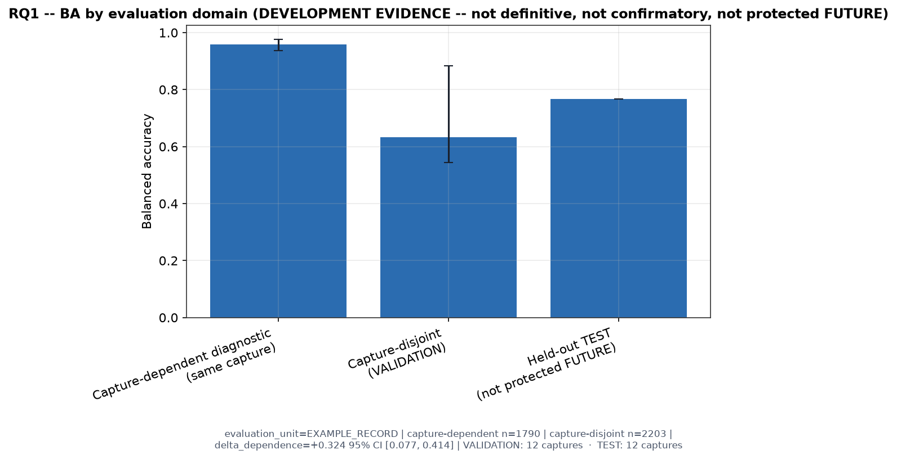
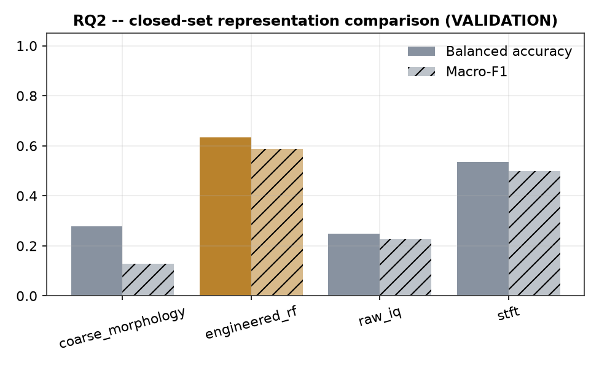
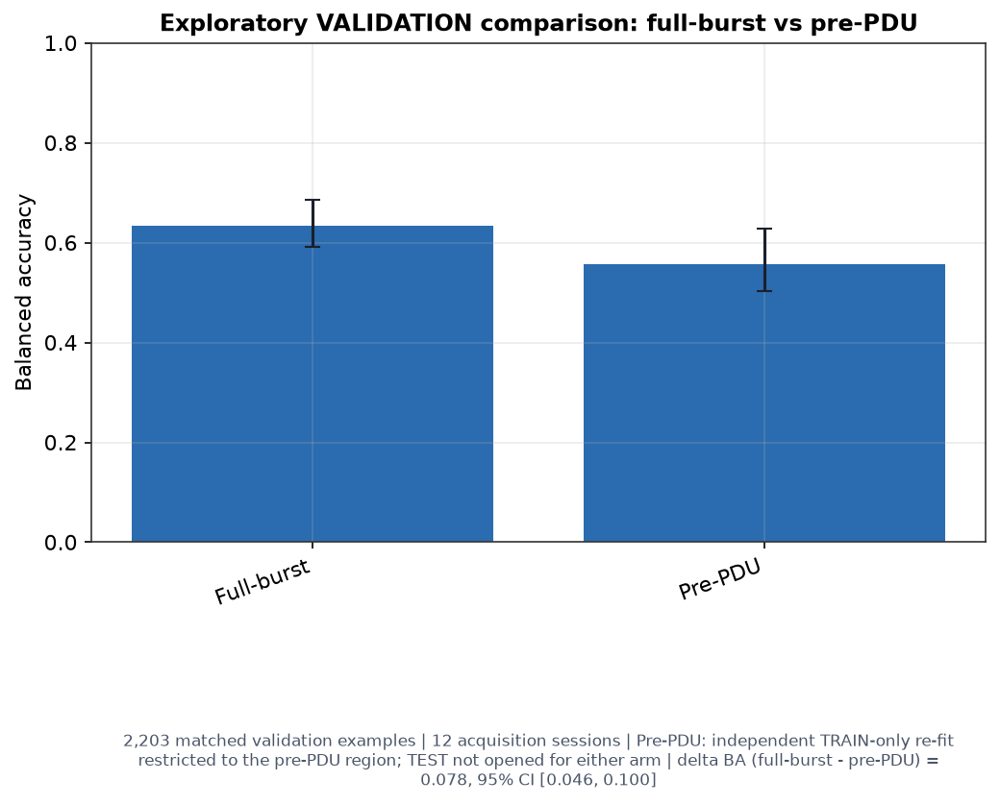
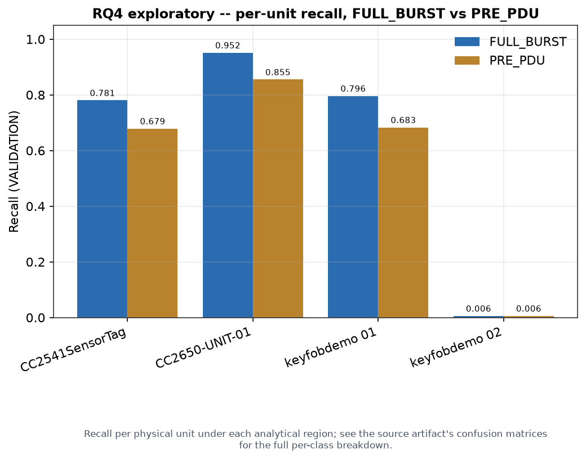
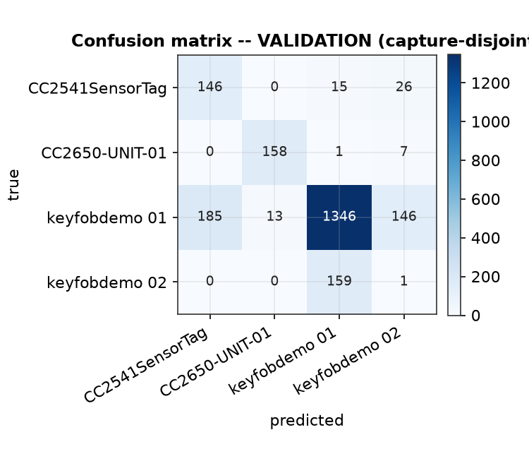
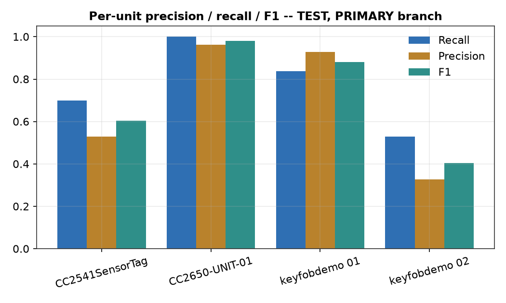
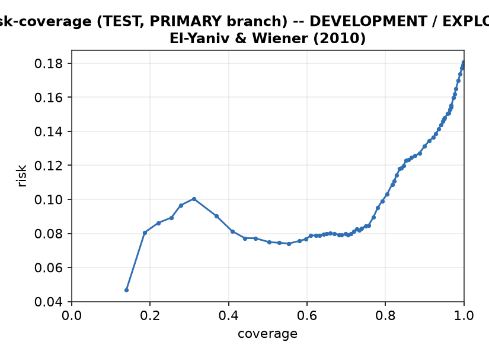
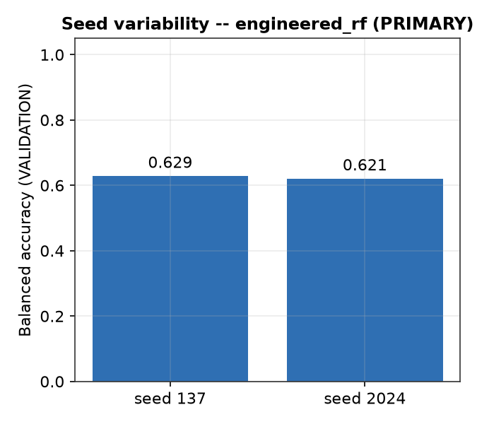
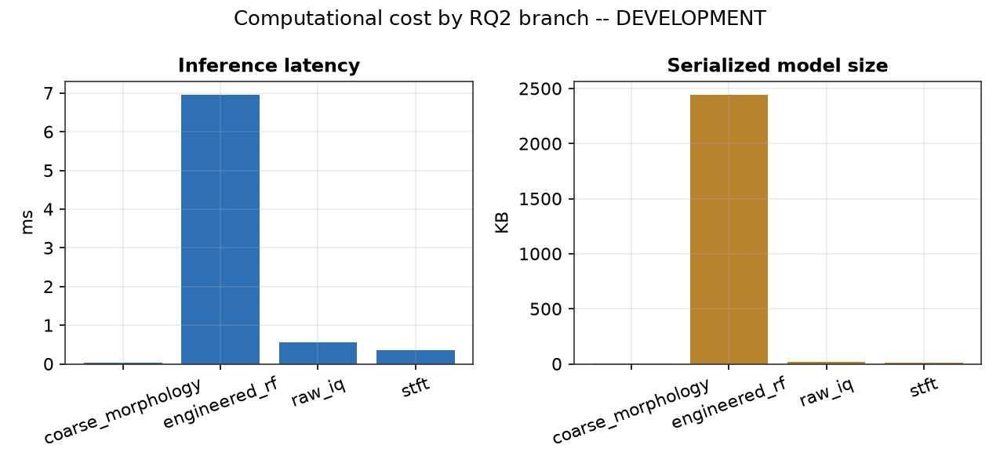
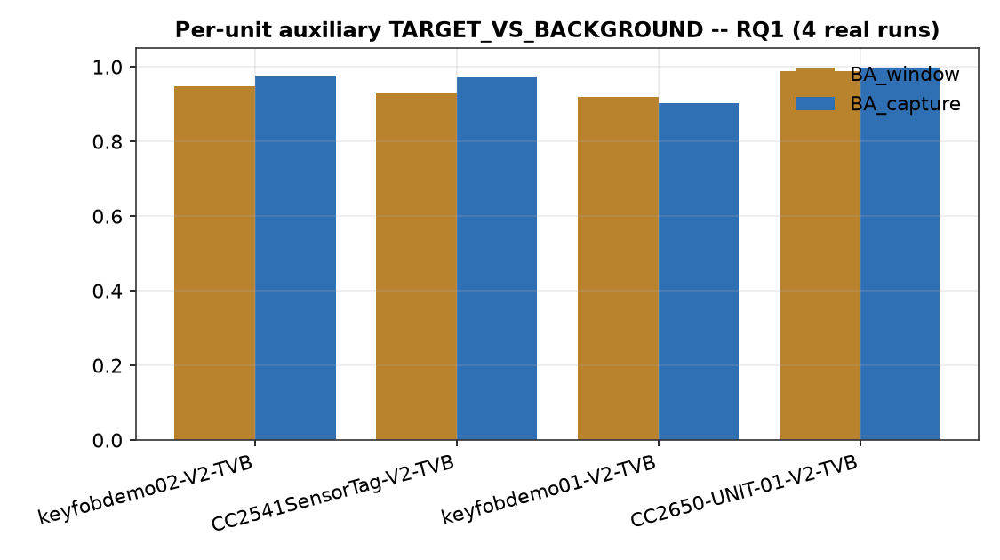

# RF-Fingerprint-Lab

**Software-defined radio research platform for RF acquisition, BLE
physical-layer device-identification research, signal analysis, and
experimental live inference.**

RF-Fingerprint-Lab combines a real **USRP B200** SDR acquisition path with a
browser-based research environment (**FastAPI** backend, **React/TypeScript**
frontend) built around one central research problem: given a known set of
enrolled BLE devices, which of them is most compatible with a later,
questioned RF emission?


---

## Start here: the practical problem

We have a limited set of physical BLE devices, previously **enrolled** —
recorded and characterized ahead of time under controlled conditions. Later,
a new RF emission appears. The practical question this project investigates
is:

**Which enrolled physical device is most compatible with this RF emission?**

**Context.** Known physical BLE devices can be recorded beforehand, under
controlled conditions.

**Problem.** A BLE advertising address is *logical* information — a value
the device's firmware reports. It is not, by itself, physical proof of
which radio actually generated the waveform: an attacker only needs to copy
that value into a different transmitter.

**Approach.** The USRP B200 preserves the actual RF waveform as raw I/Q
samples. Controlled reference examples are built from known, enrolled
devices; models are trained on those references; a later, questioned
emission is compared against the frozen enrolled set — never decided from
the advertised address alone.

```text
known devices -> enrollment -> B200 RF -> dataset -> training -> frozen model -> new emission -> comparison / inconclusive
```

## Why train a model?

Two different moments use the RF evidence differently, and the distinction
matters for the whole rest of this document.

**Enrollment** — building the reference:

```text
known device -> Windows/native BLE (independent logical observation)
             -> B200 captures real RF I/Q
             -> association / admission
             -> reference example
```

**Questioned-source comparison** — using the reference later:

```text
new RF emission -> B200
                 -> frozen preprocessing / frozen model
                 -> comparison against enrolled devices
                 -> result, or inconclusive
```

Windows/native BLE helps **build and check** the enrolled references during
enrollment. It is **not** supplied to the RF classifier as the answer during
later source comparison. If the native Windows stack had to identify every
future emission in advance, the RF-fingerprint classifier would add little
value on top of it — the entire point of BLE-RFFI Studio is a comparison
method that works from radio evidence alone, once enrollment is done.

## How the BLE-RFFI pipeline works

1. Capture RF I/Q (USRP B200, frozen acquisition profile).
2. Detect candidate bursts.
3. Recover BLE packets and verify CRC.
4. Associate packet evidence with an enrolled physical device, under a
   calibrated, **fail-closed** policy.
5. Create traceable examples tied to their exact source I/Q and sample
   range.
6. Build capture-disjoint scientific partitions (TRAIN / VALIDATION /
   protected FUTURE TEST).
7. Train -> validate -> freeze -> protected future evaluation / source
   comparison.

> **CRC-valid packet ≠ physical-source identity.** A correctly decoded
> packet proves the bits were received correctly. It does not, by itself,
> prove which enrolled physical device sent them — that is exactly what
> steps 4 and 7 exist to establish, separately and explicitly, never
> assumed from decode success alone.

---

## Four questions that keep a high score honest

A classifier can score well on held-out data for reasons that have nothing
to do with recognizing real RF hardware characteristics. These four checks
each test one specific, easy alternative explanation.

### RQ1 — Acquisition dependence

**Does it still work on a new recording?**

```text
related capture -> independent capture -> protected future period
```

Tests whether apparent performance depended on incidental context shared
between TRAIN and TEST captures (the same recording session, nearby-in-time
conditions), rather than on the device's real RF characteristics.

### RQ2 — Signal representation

**If every branch receives exactly the same admitted RF evidence, does how
we represent it change the result?**

```text
same admitted RF -> engineered features | raw I/Q | STFT time-frequency | coarse morphology
```

The same examples, the same partitions, four different representations —
see [Implemented benchmark](#implemented-ble-rffi-benchmark) below for the
four real branches this compares.

### RQ3 — Radio-state intervention

**Does turning the transmitter off and back on change the fingerprint more
than simply leaving it running?**

```text
PRE -> RESET -> POST
PRE -> CONTINUOUS/CONTROL -> POST
```

Separates a reset-associated displacement in the fingerprint from ordinary
PRE/POST drift that would happen anyway. `receiver_epoch` (identity +
qualified acquisition profile + session boundary) protects this pairing:
a PRE/POST pair is invalidated whenever the receiver's qualified state
changed between the two captures.

> **Limitation, stated explicitly.** For historical data with no logged
> restart/reconnect event, the session boundary uses a >1 hour acquisition
> gap as a documented proxy. This is **not** direct physical evidence that
> the B200 was actually restarted — see
> [`docs/ble/SCIENTIFIC_STATUS.md`](docs/ble/SCIENTIFIC_STATUS.md) §16.4.

### RQ4 — Packet-content dependence

**Is the model learning RF characteristics, or exploiting easy-to-copy BLE
packet content?**

```text
FULL_BURST | ADVA_EXCLUDED | PRE_PDU
```

`ADVA_EXCLUDED` genuinely **removes** the AdvA (advertiser address) sample
range from the analytical region — it is spliced out, never replaced with a
fixed zero block, so no artificial, trivially learnable pattern is
introduced in its place. `PRE_PDU` is:

```text
Preamble + Access Address | STOP
```

— stopping before the PDU header, so no packet payload content is present
at all in that variant.

---

## Implemented BLE-RFFI benchmark

RQ2's four real, executable signal-analysis branches — the only ones
BLE-RFFI Studio trains:

| Representation | Model(s) |
|---|---|
| Engineered RF descriptors | Logistic Regression / SVM-RBF / Random Forest |
| Raw I/Q | CNN1D |
| Time-frequency (STFT) | CNN2D |
| Coarse time-frequency morphology | Frozen morphological baseline (nearest-centroid, no iterative training) |

No other signal-analysis branch is implemented, exposed, or planned for
BLE-RFFI Studio. Ideas beyond this table (edge transformers, metric learning,
quantized inference, and similar) are tracked separately, explicitly not
mixed with the table above, in
[`docs/research/TECHNIQUE_ROADMAP.md`](docs/research/TECHNIQUE_ROADMAP.md).

### Scientific preprocessing

**`base-v1`** (identity — no signal-altering step) is the preprocessing
profile actually used to produce every real RQ1/RQ2/decision-window/RQ4-
exploratory result in this document. Two other registered profiles exist
in code but did **not** produce these results:

- **`paper-eq6-7-v1`** — implemented but not used for the current results: a
  frozen BLE reference waveform `q[n]`, phase unwrapping over a frozen
  fitting interval (`preamble + access address`), a joint least-squares
  estimate of an affine phase/frequency offset, with per-burst provenance
  when it runs. A real, useful future ablation, not part of current
  evidence.
- **`offset-retaining-v1`** — was intended as the sensitivity-analysis
  counterpart to `paper-eq6-7-v1`. Because the real PRIMARY run already
  uses identity preprocessing, `offset-retaining-v1` resolves to the exact
  same (identity) configuration as `base-v1` for every real run to date —
  the two are behaviorally indistinguishable at the signal-processing
  level, so any equality between their reported balanced accuracies is a
  trivial consequence of that equivalence, not evidence that affine phase
  compensation leaves the result unchanged.

An older, simpler heuristic (`cfo-compensated-v1`) also exists for
historical/ablation utility, explicitly labeled **heuristic/legacy**, not
an implementation of `paper-eq6-7-v1`. Full derivation and the exact
distinction between all four profiles:
[`docs/ble/PREPROCESSING.md`](docs/ble/PREPROCESSING.md).

The `cfo_estimate_hz` engineered feature (one of ten `engineered_rf`
descriptors) is a mean sample-to-sample phase-increment estimate over the
**whole**, unprocessed (`base-v1`) burst — no reference correlation, no
known-bit span, no least-squares fit. It is best read as an *apparent mean
phase rate / frequency-offset estimate*, not a validated, isolated
transmitter-CFO measurement: it can mix GFSK modulation phase structure,
true transmitter offset, and the B200 receiver's own local-oscillator
offset. None of the other nine engineered descriptors (power/amplitude
statistics, spectral centroid/bandwidth, PAPR, kurtosis, skewness) are
calibrated estimators of a specific transmitter-hardware impairment (PA
nonlinearity, phase noise, I/Q imbalance, DC offset, gain error) either —
they are general statistics that could in principle be influenced by such
impairments, never presented as isolating one.

---

## Current scientific status

**Implemented** = exists in code, wired into the real pipeline, has tests.
**Experimentally validated** = additionally exercised by the required real
campaign, with real evidence meeting its stated scientific criteria. The
second never follows automatically from the first anywhere in this project.

Three explicit status categories, used consistently across this README, the
dashboard, and [`docs/ble/SCIENTIFIC_STATUS.md`](docs/ble/SCIENTIFIC_STATUS.md):
**DEVELOPMENT EVIDENCE** (`AVAILABLE`) — real, current, non-confirmatory
evidence from today's short captures, safe to cite as DEVELOPMENT; **DEFINITIVE
/ PROTECTED FUTURE** (`NOT_YET_AVAILABLE`) — the frozen-protocol, 120 s/12-window
campaign and its one-time protected evaluation, fail-closed, not executed,
gated behind a **protocol freeze that has not started** (real, versioned
freeze mechanism exists; no protocol has been run through it — this is
distinct from individual DEVELOPMENT artifacts already being version-pinned
and reproducible, which is not the same thing as a confirmatory freeze);
**RQ3 / RQ4 packet-condition / CH37→CH38 transport / near-live** (`PENDING`
or `NOT_AVAILABLE`) — real mechanism exists, real campaign data does not
yet.

| Capability | Implemented | Real evidence / validation |
|---|---:|---|
| Real B200 I/Q capture | Yes | Yes |
| BLE packet recovery / CRC | Yes | Yes |
| Dataset + capture-disjoint leakage protection | Yes | Yes |
| TRAIN / VALIDATION / protected TEST mechanism | Yes | Mechanism tested; DEFINITIVE campaign `NOT_YET_AVAILABLE` |
| `base-v1` identity preprocessing | Yes | **Actually used** for every real RQ1/RQ2/RQ4-exploratory result below |
| `paper-eq6-7-v1` preprocessing (Eq. 6-7) | Yes | Implemented, unit/integration tested — **not used** to produce any current result (see [Scientific preprocessing](#scientific-preprocessing) above) |
| RQ1 acquisition-dependence measurement | Yes | **DEVELOPMENT EVIDENCE `AVAILABLE`** — real closed-set `delta_dependence = +0.324` (see below), class-stratified/session-clustered bootstrap CI |
| Four RQ2 model branches | Yes | **DEVELOPMENT EVIDENCE `AVAILABLE`** — real closed-set benchmark, `engineered_rf` selected PRIMARY (see below); 3 candidate model families for `engineered_rf` vs. 1 fixed configuration for each other branch, 0 hyperparameter search in any branch — not an equal-budget comparison |
| RQ4 exploratory analytical-region control (FULL_BURST vs PRE_PDU) | Yes | **DEVELOPMENT_EXPLORATORY `AVAILABLE`** — real, already executed (see below); distinct from the RQ4 packet-condition intervention row below, which remains not executed |
| Decision-window aggregation (10 s) | Yes | **DEVELOPMENT EVIDENCE `AVAILABLE`** — real TRAIN=34/VALIDATION=12/TEST=12 windows, 4/4 TX (see [`PAPER_EVIDENCE_MAP.md`](docs/ble/PAPER_EVIDENCE_MAP.md)); operational coverage `0.833` in both VALIDATION/TEST, not `1.000` (see below); DEFINITIVE campaign `NOT_YET_AVAILABLE` |
| Abstention / coverage / risk-coverage | Yes | **DEVELOPMENT / EXPLORATORY** — real but small-sample (12 windows/domain); operational coverage `0.833` ≠ argmax accuracy; DEFINITIVE campaign `NOT_YET_AVAILABLE` |
| PRE/POST RESET-CONTROL framework (RQ3) | Yes | `PENDING` — sample size frozen (80 pairs); 0 real pairs captured yet |
| RQ4 packet-condition intervention (original vs. controlled variant) | Yes | `NOT_AVAILABLE` — **0/4 enrolled units eligible**, real evidence recorded per unit (see below). Not to be confused with the already-executed analytical-region control above. |
| CH37→CH38 transport measurement | Yes (transport analysis not yet run) | `NOT_AVAILABLE` for the transport result — but real CH38 RF data already exists: **1,663 admitted examples** for the four enrolled units, deliberately excluded from the RQ1/RQ2/RQ4 channel-37-only split |
| CH39, near-live inference | Yes | `NOT_AVAILABLE` — **0 real CH39 captures for the four enrolled units** (exactly 1 CH39 capture exists anywhere in the store, for an unrelated diagnostic unit); no real near-live-prediction collection wired yet |
| Strong native <-> SDR association | Mechanism yes | **No — 0 STRONG, no accepted calibration policy** (fail-closed, real negative result) |
| Protected future scientific result | Mechanism yes | **`NOT_YET_AVAILABLE`** — not executed, fail-closed |
| Same-family verification (`keyfobdemo 01`/`02`) | Mechanism yes | **Not verified** — no `same_model_group` currently verified for any enrolled pair; both units are referred to as *two key-fob-class units*, not a validated same-family pair (see [Limitations](#limitations-stated-explicitly) below) |

A passing test suite is evidence the code does what its own tests assert —
it is never treated as scientific validation anywhere in this project.

**Association, stated plainly**: the association mechanism is implemented
and **fail-closed**
(`ScientificResultsRepository.find_frozen_association_policy()` currently
returns `None`). The latest real calibration attempt swept the full
threshold grid (`50`–`500 ms`) and found `0.0` coverage at every threshold
against the required `≥0.95` — result `NO_THRESHOLD_SATISFIES_CRITERIA` —
and the real corpus currently contains **0 STRONG** associations across all
five registered units. Consequently: `CRC-valid packet ≠ physical-source
identity`, and `native context ≠ STRONG association`. This is a real,
current negative result, not a criterion that was loosened to get a pass.

Full current-state detail, every real number behind the table above, and
the complete evidence-to-decision trace live in
[`docs/ble/SCIENTIFIC_STATUS.md`](docs/ble/SCIENTIFIC_STATUS.md).

### DEVELOPMENT evidence vs. PROTECTED FUTURE

**DEVELOPMENT evidence** (`AVAILABLE` — real, current, non-confirmatory):
- RQ1 `EXAMPLE_RECORD` diagnostic — capture-dependent / capture-disjoint / held-out TEST (see the table below)
- RQ2 `VALIDATION` — four representations (see below)
- 10-second decision-window check (`06_statistics/coverage_analysis_report.json`,
  `paper_exports/development_decision_window_summary.csv`):
  - `TRAIN=34`, `VALIDATION=12`, `TEST=12` real windows — **all 4/4 classes represented in every partition**
  - `VALIDATION`: `BA=0.750`, `accuracy=0.833` (argmax accuracy, 10/12 — see coverage note below)
  - `TEST`: `BA=0.875`, `accuracy=0.917` (argmax accuracy, 11/12 — see coverage note below)
  - **Operational coverage is `0.833` in both partitions, not `1.000`** — the
    acceptance threshold (`0.66`, calibrated on VALIDATION) rejects 2 of 12
    windows in each partition as `UNKNOWN`. Argmax accuracy (every admissible
    window scored by its winning class regardless of threshold) is a
    different quantity from accuracy among *accepted* decisions: VALIDATION
    has `9/10` accepted-and-correct plus one confident misclassification that
    the threshold did not catch (accepted-and-incorrect); TEST has `10/10`
    accepted-and-correct, with its one argmax error itself rejected by the
    threshold rather than accepted.

**PROTECTED FUTURE**: `NOT_YET_AVAILABLE` — not executed, fail-closed. That real
10-second-window DEVELOPMENT evidence exists above does **not** mean the
definitive 120-second campaign has been run — the two stay structurally
separate everywhere in this repository (dashboard, `paper_export.py`,
`docs/ble/SCIENTIFIC_STATUS.md`); never conflated.

### Real closed-set benchmark result (2026-08-16)

Current real four-unit closed-set DEVELOPMENT benchmark (`CC2541SensorTag`,
`CC2650-UNIT-01`, `keyfobdemo 01`, `keyfobdemo 02` — V2-admitted, session-disjoint,
leakage check `PASSED`, 9,891 real examples across 79 real B200 captures, Shelly excluded
as a class, no background pooled in as a fifth class). Protected FUTURE has not been
acquired and the protocol freeze has not started (§Current scientific status above), so
this result is DEVELOPMENT evidence, not a definitive/confirmatory outcome:

Evaluation unit for every row below is `EXAMPLE_RECORD` (burst-level) — a
separate, real 10-second decision-window evaluation exists too (see
[the window-level scoping fix and DEVELOPMENT decision-window table](docs/ble/PAPER_EVIDENCE_MAP.md)),
never conflated with this one.

| Evaluation domain (RQ1) | Balanced accuracy | 95% CI | n (examples / sessions) |
|---|---:|---:|---:|
| Capture-dependent (same capture, intentionally leakage-optimistic diagnostic) | 0.958 | [0.939, 0.975] | 1,790 / 34 |
| Capture-disjoint (VALIDATION) | 0.634 | [0.591, 0.685] | 2,203 / 12 |
| Held-out TEST (PRIMARY branch, not protected FUTURE) | 0.767 | — (no CI persisted for this domain) | 2,464 / 12 |

`delta_dependence = capture-dependent − capture-disjoint = +0.324`, 95% CI `[0.269, 0.371]` —
a class-stratified, session-clustered bootstrap (cluster key = `session_id`; stratified by
`physical_unit_id` so every replicate keeps all four enrolled classes; `n_resamples=2000`,
seed `12345`), with the two domains resampled **independently** (no physical pairing exists
between capture-dependent and capture-disjoint sessions — this is not a "paired" bootstrap).
A real, on-hardware measurement of exactly the optimism RQ1 is designed to detect: a
single-recording evaluation would have overstated closed-set discrimination by roughly 32
balanced-accuracy points relative to genuinely disjoint captures. The capture-dependent
diagnostic gets its own real bootstrap CI too (it is intentionally leakage-optimistic by
design, not a confirmatory estimator -- but its own resampling uncertainty is still a real,
reportable quantity, never omitted just because the point estimate itself is optimistic).

**Bootstrap-method correction (2026-08-22)**: the RQ1 CIs above use a corrected,
class-stratified bootstrap (`stratified_hierarchical_cluster_bootstrap` /
`independent_domain_bootstrap_delta_ci`, `backend/app/modules/ble_scientific_results/
statistics/inference.py`). The prior, unstratified pooled resample of the 12-session
capture-disjoint domain dropped at least one enrolled class from a nontrivial fraction of
its replicates, silently redefining balanced accuracy over fewer than four classes in those
replicates; the delta CI was also previously described as a "paired cluster bootstrap",
which it is not (the two domains have no physical session pairing). Point estimates
(0.958 / 0.634 / delta 0.324) are unchanged — only the CI construction and its terminology
were corrected. Full method detail: [`docs/ble/TECHNICAL_EVIDENCE_AUDIT.md` §1](docs/ble/TECHNICAL_EVIDENCE_AUDIT.md#1-rq1--current-result).

**Coherence-audit correction (2026-08-19)**: capture-disjoint VALIDATION was previously
reported as 0.749 -- that was raw accuracy, not balanced accuracy, due to a real bug in
`evaluate_rq1_acquisition_dependence()` (`window_report.accuracy`/`capture_report.accuracy`
instead of `.balanced_accuracy`). Corrected value (0.634) now matches RQ2's `engineered_rf`
PRIMARY branch VALIDATION balanced accuracy exactly, verified by hashing the two real
example_id sets (identical, 2,203 examples, same training run, same predictions). No
retraining, no new capture, no criteria/threshold change -- the fix only corrects which
already-computed real field gets read.



RQ2 branch comparison (VALIDATION, same admitted groups):

| Branch | Balanced accuracy | Macro-F1 |
|---|---:|---:|
| coarse_morphology | 0.277 | 0.128 |
| **engineered_rf (PRIMARY)** | **0.634** | **0.586** |
| raw_iq | 0.248 | 0.226 |
| stft | 0.537 | 0.498 |

`engineered_rf` (best of Logistic Regression / SVM-RBF / Random Forest, selected on
VALIDATION only) was selected PRIMARY in this run and independently in all 4 per-unit
auxiliary runs below — a real, repeated finding, not a single cherry-picked outcome.
**Model-selection budget is not equal across branches**: `engineered_rf` evaluated 3
candidate model families on VALIDATION and kept the best; `raw_iq`, `stft`, and
`coarse_morphology` each used exactly 1 fixed configuration; none of the four branches ran a
hyperparameter search within its own family. This is a comparison under a disclosed,
unequal selection procedure, not an equal-budget benchmark.



### RQ4 exploratory analytical-region control: FULL_BURST vs PRE_PDU (2026-08-21)

A narrower, already-executed control, distinct from the RQ4 packet-condition intervention
below (which remains not executed): restricting which samples of the **same,
already-acquired** VALIDATION burst are available to the model, without changing what the
transmitter sent. `PRE_PDU` keeps only the preamble (8 bits) + access address (32 bits),
ending strictly before the PDU header — the PDU header, AdvA, and payload are unavailable.
TRAIN and VALIDATION stay separated throughout; `FULL_BURST` reuses the existing PRIMARY
model and its already-persisted predictions (no recomputation), while `PRE_PDU` is an
**independent TRAIN-only re-fit** (fresh `TrainOnlyScaler`, same frozen Random Forest
configuration as PRIMARY, no hyperparameter search) evaluated only on PRE_PDU-VALIDATION.
**TEST was not opened for either arm** (the PRE_PDU bundle's own export gate records
`approval_status=TEST_NOT_EXECUTED`). Both arms were verified to share the identical 2,203
VALIDATION `example_id`s, in the same order, across the same 12 sessions and 4 classes,
before any statistic was computed. This result is marked `DEVELOPMENT_EXPLORATORY`: it was
defined and run after the RQ1/RQ2 VALIDATION/TEST results above had already been inspected
(post-hoc, not pre-registered), and it does not substitute for the RQ4 packet-condition
intervention.

| Region | BA | 95% CI | Macro-F1 | Accuracy | n (examples / sessions) |
|---|---:|---:|---:|---:|---:|
| FULL_BURST | 0.634 | [0.591, 0.685] | 0.586 | 0.749 | 2,203 / 12 |
| PRE_PDU | 0.556 | [0.503, 0.628] | 0.495 | 0.647 | 2,203 / 12 |

`delta BA (FULL_BURST − PRE_PDU) = 0.078`, 95% CI `[0.046, 0.100]` — a genuinely matched,
class-stratified, session-clustered bootstrap (same resampled session indices drawn once
per class stratum per replicate, applied jointly to both regions, since both score the
identical evidence under two analytical regions; no confirmatory significance test is
reported for this exploratory contrast).



Substantial closed-set discrimination remains under PRE_PDU (well above the four-class
chance level of 0.25). **This does not isolate transmitter-hardware effects** — propagation,
receiver state, received power, session-specific conditions, and other acquisition
dependencies remain present in PRE_PDU and are not separated from any transmitter-specific
contribution by this control. The 0.634 → 0.556 decrease is itself the result: evidence that
closed-set performance depends in part on the analytical region available to the model, not
an estimate of what fraction of discrimination is attributable to packet content.

Per-class recall is markedly heterogeneous and must be read alongside the aggregate BA:

| Unit | Recall, FULL_BURST | Recall, PRE_PDU | Δ |
|---|---:|---:|---:|
| CC2541SensorTag | 0.781 | 0.679 | +0.102 |
| CC2650-UNIT-01 | 0.952 | 0.855 | +0.096 |
| keyfobdemo 01 | 0.796 | 0.683 | +0.113 |
| keyfobdemo 02 | 0.006 | 0.006 | +0.000 |

`keyfobdemo 02` recall is **0.006 (1/160) under both regions, unchanged by the
analytical-region restriction.** Under FULL_BURST, 159/160 (99.4%) are assigned to
`keyfobdemo 01`, 0 to either sensor-platform unit. Under PRE_PDU, the misclassification
distribution shifts: 157/160 (98.1%) go to `keyfobdemo 01` and 2/160 (1.3%) to
`CC2650-UNIT-01`. Recall itself does not change between regions; where the misclassified
examples land does.
Balanced accuracy already reflects this heterogeneity (each class weighted equally), but a
single aggregate number can still obscure which class drives it.



Full provenance (dataset/split hashes, model configuration, per-class confusion matrices,
PRIMARY-untouched hash comparison, `TEST_NOT_EXECUTED` gate): `06_statistics/
rq4_full_burst_vs_pre_pdu_exploratory_report.json`; consolidated technical detail:
[`docs/ble/TECHNICAL_EVIDENCE_AUDIT.md` §7](docs/ble/TECHNICAL_EVIDENCE_AUDIT.md#7-full_burst-vs-pre_pdu--full-consolidation).

Confusion matrices, capture-disjoint VALIDATION vs. held-out TEST (PRIMARY branch) —
CC2650-UNIT-01 is perfectly separated (recall 1.0) in both:




Per-unit TEST precision/recall/F1 (PRIMARY branch), reported individually because the
aggregate balanced-accuracy number hides real, large per-source spread on this naturally
imbalanced split (TEST alone ranges from 166 to 1,857 examples per unit):

| Unit | Recall (TEST) |
|---|---:|
| CC2650-UNIT-01 | 1.000 |
| keyfobdemo 01 | 0.837 |
| CC2541SensorTag | 0.699 |
| keyfobdemo 02 | 0.530 |



**Risk-coverage curve** (TEST, PRIMARY branch) — the exact selective-prediction curve
(El-Yaniv & Wiener, 2010) the platform's abstention mechanism is built on, one point per
achievable confidence threshold on the real closed-set TEST split:



**Seed variability** — the PRIMARY branch re-trained under the platform's two other frozen
seeds (`137`, `2024`, VALIDATION-only), a real reproducibility check:



**Enrolled-population class-exclusion metric sensitivity** — a post-hoc recomputation of the
aggregate VALIDATION balanced accuracy from PRIMARY's own already-scored predictions,
excluding one physical class's examples from the metric at a time. The model itself is
**not retrained** without that class — this is not leave-one-device-out cross-validation and
is never described as one. Relative to the full-set BA of 0.634, excluding
`keyfobdemo 02`'s examples raises the remaining-class BA to 0.843 (`Δ=+0.209`), while
excluding any of the other three units lowers it by 0.049–0.106 — real evidence that the
aggregate score depends on the enrolled comparison population and is not a
population-independent measure of transmitter identifiability.
[`docs/ble/TECHNICAL_EVIDENCE_AUDIT.md` §1](docs/ble/TECHNICAL_EVIDENCE_AUDIT.md) has the
full per-unit table and source function.

**Offset-retaining preprocessing sensitivity** — `offset-retaining-v1` produced the same
aggregate BA (0.634) as PRIMARY, but this equality is **not informative**: PRIMARY already
uses identity (`base-v1`) preprocessing, so `offset-retaining-v1` resolves to the same
identity configuration for this run — the two are not distinguishable at the
signal-processing level, and the equality is a trivial consequence of that, not a validated
finding about affine phase compensation.

**Computational cost** — real inference latency and serialized model size per RQ2 branch,
supporting the RQ2 computational-cost comparison (`engineered_rf`, a
Random Forest here, is real evidence that the lowest-macro-F1 branch is not automatically
the cheapest one either — heavier than both CNN branches in this run):



4 auxiliary per-unit TARGET_VS_BACKGROUND detectors (not the closed-set result above)
were also run — real per-unit `delta_dependence` ranges from -0.042 to +0.018, all
substantially smaller than the closed-set effect above (target-vs-background is an
easier task with more redundant evidence per window; the multiclass task is where
acquisition dependence actually shows up):



**RQ3** — sample size frozen (`rq3_sample_size` scientist decision,
`PROSPECTIVE_BALANCED_WITHIN_DEVICE_CROSSOVER`): 10 RESET + 10 CONTROL pairs per unit,
80 pairs / 160 captures total across the 4 units. **0 real captures carry RQ3 metadata and 0
valid empirical intervention pairs exist today** — the protocol is implemented, not yet
executed; no nominal statistical power is declared, since no real RQ3 variance estimate
exists yet.

**RQ4 packet-condition intervention** (original packet configuration vs. a controlled,
verified variant — distinct from the already-executed FULL_BURST/PRE_PDU analytical-region
control above) — real eligibility check completed for every enrolled unit:
`RQ4 = DATA_NOT_AVAILABLE: CONTROLLED_VARIANT_NOT_AVAILABLE` (0/4 enrolled units eligible; no
enrolled unit has documented, independently-verified control over its own packet content —
full per-unit reasons in [`docs/ble/SCIENTIFIC_STATUS.md`](docs/ble/SCIENTIFIC_STATUS.md)).
This intervention itself remains not executed; the analytical-region control above is a
separate, narrower, already-real result and does not change this status.

**CH37 → CH38 transport** — real CH38 RF data already exists for the four enrolled units
(**1,663 admitted examples**, deliberately excluded from the RQ1/RQ2/RQ4 split by the
channel-37-only scoping rule), but the transport analysis itself has not been run: no
`channel_transport_report.json` exists yet, and this README makes no transport claim.
**CH39** has **0 real captures for the four enrolled units** — exactly 1 CH39 (2,480 MHz)
capture exists anywhere in the current capture store, and it belongs to an unrelated
diagnostic unit (`SHELLY-PLUG-01`), not one of the four closed-set units.

**Confusion matrix, normalized by true class** (TEST, PRIMARY branch) — same real counts
as above, row-normalized to a per-class percentage with `n` kept as secondary per-cell
information, the canonical reference view:


**Campaign timeline** — every study phase, qualification through protected FUTURE and
confirmatory analysis, colored by its real, current `execution_state` (never hand-drawn —
rendered once by the paper-export pipeline and reused verbatim below):


**Forensic evidence lineage** — source I/Q → burst → PDU → admitted example → dataset →
split → preprocessing → model → RQ1/RQ2 decision, traced with real IDs from the closed-set
PRIMARY branch (dataset id/version, split id, training run id, model bundle id), not a
dashboard screenshot. Full hashes stay in `paper_exports/figure_manifest.json`, not baked
into the image:


**Methodological audit (2026-08-19)** — before the next technical revision, every claim
below was re-verified against real canonical artifacts (never reconstructed from memory);
full detail, exact field-by-field sourcing, and the 3 regenerated technical evidence figures
above are in [`docs/ble/SCIENTIFIC_STATUS.md` §19](docs/ble/SCIENTIFIC_STATUS.md#19-methodological-audit-2026-08-19--acquisition-profile-bootstrap-spec-corpus-counts-rq2-paired-uncertainty-model-configs-test-vs-protected-future-publication-figures):

| Check | Result |
|---|---|
| RF acquisition profile complete? | **Partial.** Receiver/SDR/channel/frequency/sample-rate/bandwidth/gain/duration are all real and fully sourced; antenna model, TX–RX distance/geometry, and environment/location have **no schema field at all** (`NOT_AVAILABLE`, structural, not a search failure). |
| RQ1 bootstrap fully specified? | **Yes.** Cluster unit = real `session_id` (34 clusters/1,790 examples dependent domain vs. 12 clusters/2,203 examples capture-disjoint domain, zero session overlap); percentile CI, `n_resamples=2000`, `confidence_level=0.95`, seed `12345`; both the 0.958 and 0.634 CIs use the identical resampling scheme, only the input population differs. |
| Corpus counts complete? | **Yes.** Per-unit, per-domain example/capture/session counts in §19.3 — the independent experimental unit is the capture/session (1:1 with a 10 s decision window today), not the individual example record. |
| RQ2 paired uncertainty available? | **Yes**, via the existing bootstrap mechanism (no new statistic) — real, verified matched-pairs CIs for engineered_rf vs. each other branch, computed for this audit, not yet a persisted canonical field. |
| Model configuration recovered? | **Yes.** RF/LogReg/SVM/CNN1D/CNN2D/nearest-centroid morphology — exact real hyperparameters and `random_seed=42`, in §19.5. |
| TEST ≠ protected FUTURE verified? | **Yes**, structurally: `SplitManifest.TEST` and `HoldoutGroup.FUTURE_TEST` are different contract types; zero real `FUTURE_TEST` assignments exist on disk today. |
| Technical evidence figures regenerated? | **Yes** — RQ1 domains, RQ2 branches, and forensic lineage, same real data, no dev-evidence caption/hashes baked in, human-readable RQ2 labels, `[0,1]` BA axis. |

**Technical evidence audit (2026-08-22/23)** — a second, independent pass re-verified every
number above directly against the canonical JSON artifacts (not against this document's own
prior prose), fixed the RQ1 bootstrap method described above, and added the RQ4 exploratory
FULL_BURST/PRE_PDU control and its two figures. Full field-by-field sourcing, a canonical
artifact inventory with SHA-256, and two complete traceability chains (one VALIDATION
prediction, one TEST prediction, each traced back to a rehashed source I/Q file) live in
[`docs/ble/TECHNICAL_EVIDENCE_AUDIT.md`](docs/ble/TECHNICAL_EVIDENCE_AUDIT.md), with the
underlying small JSON artifacts published under
[`docs/ble/evidence/`](docs/ble/evidence/).

All figures above are generated straight from the platform's own real, persisted evidence
by [`docs/ble/generate_evidence_figures.py`](docs/ble/generate_evidence_figures.py) —
never hand-drawn, never from a spreadsheet copy, never manually edited to change a number.
Re-run it after any new real RQ1/RQ2/RQ3/RQ4 result to regenerate every PNG in this section
from current state; `--verify` cross-checks every figure's source-artifact hash and rendered
label/CI text against the real artifacts on disk without regenerating anything. The last 3
figures (normalized confusion matrix, campaign timeline, forensic lineage) and the two RQ4
figures are not re-plotted by that script — it calls the platform's own paper-export
pipeline (`ScientificResultsRepository.run_paper_export()` → `paper_export.py` →
`figures/paper_figures.py`, the same renderer the PDF/SVG exports use) and
copies the PNG variant it already wrote, so there is exactly one real computation behind
each of those figures, never two independent plots. The same real data, with the same
plotting functions, is also available as a runnable, GitHub-renderable notebook:
[`docs/ble/evidence_figures.ipynb`](docs/ble/evidence_figures.ipynb) (regenerate via
[`docs/ble/build_evidence_notebook.py`](docs/ble/build_evidence_notebook.py) after running
the figure script).

**Regenerating these figures — two equivalent paths, same real code:**

1. **From the platform itself** — BLE Scientific Results Studio → **Evidence Dashboard** tab
   → **"Generar imagenes nuevas (README + notebook)"** button. Calls
   `POST /api/ble-scientific-results/evidence-dashboard/regenerate-figures`, which loads and
   runs the exact same `generate_evidence_figures.py` / `build_evidence_notebook.py` `main()`
   functions listed above (never a second implementation) and reports back which files were
   written.
2. **From a terminal**, manually, running the same two scripts directly (commands above).

Either path only writes real PNG/`.ipynb` files into the repo working tree — neither commits
nor pushes anything; review the diff and `git add / commit / push` yourself afterward.

These same results, plus the per-unit auxiliary runs, RQ3's live campaign progress, and
RQ4's per-unit eligibility, are also readable live (not a snapshot) from the platform
itself: BLE Scientific Results Studio → **Evidence Dashboard** tab, `GET
/api/ble-scientific-results/evidence-dashboard`.

### Limitations, stated explicitly

- **Session/transmitter confounding.** No current receiver session contains more than one
  enrolled transmitter (verified: 79/79 sessions in the closed-set dataset are single-unit).
  Each transmitter is represented across multiple sessions, so transmitter identity and
  session are not mathematically identical variables — but the design lacks within-session
  multi-transmitter observations that would let transmitter effects be directly separated
  from session-specific receiver, propagation, noise, or environmental state. This applies to
  every result above, including RQ1's acquisition-dependence contrast and the RQ4 exploratory
  analytical-region control.
- **No calibrated per-burst SNR.** The acquisition profile records receiver gain, sample
  rate, bandwidth, and center frequency, but no per-burst SNR or received-power estimate is
  computed or persisted alongside each example; the engineered `mean_power_dbfs` descriptor
  is a raw amplitude statistic, not a calibrated SNR measurement.
- **Same-family verification.** `keyfobdemo 01` and `keyfobdemo 02` share a compact
  key-fob-class form factor and an operator-declared `device_family` string, but chip/radio
  identity, hardware revision, firmware, and packet-configuration equivalence have not been
  independently verified for this pair — `same_model_groups.verified_groups` is empty for
  every enrolled pair. They are referred to as *two key-fob-class units*, never as a
  validated same-model or same-family pair, and no same-family stress test is reported.
- **Protocol freeze.** The frozen analytical-contract mechanism is real and versioned, but no
  protocol has been run through the confirmatory freeze ceremony that would make protected
  FUTURE access eligible. This is distinct from individual DEVELOPMENT artifacts (dataset,
  split, model bundle) already being version-pinned, hashed, and reproducible — that is not
  the same thing as a confirmatory freeze for FUTURE.
- **Development label admission ≠ independently corroborated source association.** All 9,891
  admitted labels (4,338 physically-isolated, 5,553 pre-registered-address-bound) are
  development label admissions under the controlled-acquisition protocol — sufficient to run
  the DEVELOPMENT benchmark above, but not equivalent to `STRONG` native-BLE/SDR association,
  for which the real corpus currently has 0 examples and no accepted calibration threshold.

Full detail behind each item above, including the exact artifacts and computed values:
[`docs/ble/TECHNICAL_EVIDENCE_AUDIT.md`](docs/ble/TECHNICAL_EVIDENCE_AUDIT.md).

- **Conventional BLE adapter (used alongside the B200).** Adapter
  manufacturer/model/chipset/VID-PID/firmware are not documented anywhere in
  the codebase — only "the OS-default Bluetooth adapter" is queried, with no
  hardware descriptor captured. Stack: Bleak `0.22.3` on the WinRT backend
  (Windows). The adapter never provides I/Q — it only supplies passive
  advertising observations (address, RSSI, TX power, manufacturer/service
  data) with host-side timestamps generated at Python-callback time, not at
  RF-reception time; there is no RF-level or hardware-clock synchronization
  with the B200, only host-clock proximity and a ±250 ms association window.
  RSSI is diagnostic only and is not one of the ten B200-derived RFFI
  features. Full audit, exact code paths, and the reproducibility table:
  [`docs/ble/BLE_ADAPTER_TECHNICAL_AUDIT.md`](docs/ble/BLE_ADAPTER_TECHNICAL_AUDIT.md).
- **USRP B200 acquisition chain.** The real BLE-RFFI capture path uses the
  SoapySDR Python bindings directly
  (`SoapySDR.Device({"driver":"uhd","serial":...})`,
  `setSampleRate`/`setFrequency`/`setBandwidth`/`setGain`/`setupStream`/
  `readStream`) inside `backend/tools/ble_sdr_capture_worker.py`, launched
  as a subprocess by `BleCaptureJobManager`/`BleIqCaptureService` using a
  RadioConda Python interpreter — never GNU Radio, which is a separate,
  unrelated general-purpose spectrum-tools subsystem in this same repo.
  UHD version is persisted per real capture (`"UHD 4.8.0.0-release"`
  observed); SoapySDR's own library/API/ABI version is not persisted for
  any completed capture. Full chain, per-layer evidence, and the
  reproducibility table:
  [`docs/ble/B200_ACQUISITION_CHAIN_TECHNICAL_AUDIT.md`](docs/ble/B200_ACQUISITION_CHAIN_TECHNICAL_AUDIT.md).

---

## Quick start

```powershell
uhd_find_devices
uhd_usrp_probe
```

Then, from the repository root:

```powershell
powershell -ExecutionPolicy Bypass -File .\start_unified.ps1
```

Core operator path once both processes are running:

```text
Live Monitor -> Capture Lab -> BLE-RFFI Studio -> Dataset Builder -> Training / Evaluation -> Experimental inference
```

Manual setup, environment variables, and every other operator view are
documented in [Documentation](#documentation) below — this section
intentionally stops at "how to start."

---

## Platform views

BLE-RFFI Studio (above) is the platform's primary research workflow. The
same backend also hosts the general SDR/RF workspace it is built on.

### Live Monitor -- `/spectrum`

Real-time RF workspace: SDR connection and stream controls, frequency,
span, sample-rate, gain, antenna, markers, and visualization.


<details>
<summary>Waterfall, RF Intelligence overlay, Spectrum Tools, legacy view</summary>


Spectrum Tools definitions and validation checks:
[`frontend/src/features/spectrum-tools/VALIDATION.md`](frontend/src/features/spectrum-tools/VALIDATION.md).

</details>

### Capture Lab -- `/capture`

Controlled acquisition of real complex I/Q: immediate capture, or triggered
burst capture with a bounded pre-trigger buffer. Every capture preserves
raw I/Q, acquisition configuration, timing, labels/split, quality metadata,
and a SHA-256 checksum.


<details>
<summary>Earlier Capture Lab signal-analysis interface</summary>


</details>

### Dataset Builder -- `/dataset-builder`

The governance gate between acquisition and model use: offline QC, label
and review-state management, experimental split control, and
duplicate/overlap safeguards before anything can enter training or
validation.


### BLE-RFFI Studio -- `/ble-rffi-studio`

The workflow this document is built around (see above) — capture,
evidence, dataset, split, training, decision windows, and experimental
live inference, over real USRP B200 acquisitions. No dedicated UI
screenshot is included in this README yet; the module's own scope,
findings, and real evidence are documented in
[`backend/app/modules/ble_rffi_studio/README.md`](backend/app/modules/ble_rffi_studio/README.md)
and [`docs/ble/SCIENTIFIC_STATUS.md`](docs/ble/SCIENTIFIC_STATUS.md).

### BLE Scientific Results Studio -- `/ble-scientific-results`

Turns BLE-RFFI Studio's captures into the formal scientific record behind
the four questions above: strict association semantics (a resolved
`physical_unit_id` context alone is never treated as a
`TARGET_ASSOCIATED_PACKET` -- that requires a real, frozen-policy match), an
eligibility/diagnostics split, protocol-deviation classification, and real
time-based decision windows. Its **Guided Validation** tab is a real, wired
capture-first wizard for non-experts (Live Timing Diagnostic, Reinforced
Target-Absence Control) -- real runs so far are consistent with the 0 STRONG
associations already stated above. Its **Evidence Dashboard** tab is a live,
refreshable, in-platform view of the real closed-set/per-unit RQ1-RQ2
results, RQ3 sample-size decision and campaign progress, and RQ4 per-unit
eligibility summarized under "Real closed-set benchmark result" above --
reads the same persisted artifacts live, never a snapshot, and now also shows
bootstrap CI error bars on `BA_capture`, a raw/normalized confusion-matrix
toggle, real decision-window/capture counts per domain, the PRIMARY
selection-domain badge, and a `CURRENT TEST EVIDENCE` label on risk-coverage
(the confirmatory `DEFINITIVE` variant stays pending until the protected
FUTURE campaign runs). Its **Supporting Tables** tab adds the composition
tables the figures above summarize -- per-transmitter capture composition,
per-partition windows/captures/sessions for any real split, label provenance
(STRONG vs. declared-isolation association), and receiver-epoch composition.
Its **Scientific Completeness** tab renders ONE real, live status per paper
element (AVAILABLE / PENDING_REAL_ACQUISITION / BLOCKED / NOT_ELIGIBLE /
PROTECTED, with the real missing evidence) -- the in-platform mirror of
[`PENDING_TO_CLOSE.md`](PENDING_TO_CLOSE.md). No dedicated UI screenshot yet;
detail: [`docs/ble/SCIENTIFIC_STATUS.md`](docs/ble/SCIENTIFIC_STATUS.md).

### RF Intelligence -- `/rf-intelligence`

Real-time RF object detection and cautious rule/profile-based protocol
hypotheses. Energy in a frequency region is never treated as proof that a
protocol has been decoded.


### Demodulation -- `/demodulation` and Live Demodulation -- `/live-demodulation`

Marker-selected or stored-acquisition demodulation (analog, digital, BLE,
IEEE 802.15.4, OOK/FSK, and experimental protocol pipelines), plus
continuous AM/FM/NFM/WFM audio recovery from the live stream. A signal is
never reported as successfully decoded merely because RF energy was
observed.


<details>
<summary>Live Demodulation</summary>


</details>

### Other views

Mission Control (`/`, operational dashboard), Spectrum Tools, RF Experiment
Lab (`/rf-experiment-lab`, the general-technique registry — E0/E1/E3/E5
implemented, see
[`docs/research/TECHNIQUE_ROADMAP.md`](docs/research/TECHNIQUE_ROADMAP.md)
for what is not), E6 Oracle-Style Lab (`/e6-oracle-style-lab`, a separate,
non-BLE classical-ML lab), RF Signal Understanding, Training/Retraining/
Validation/Inference/Models, Waterfall, Recordings, KiwiSDR Map, and
Settings are all real, working views of the same backend — module-by-module
detail: [`backend/README.md`](backend/README.md).

---

## Architecture and evidence lineage

```text
RF-Fingerprint-Lab
|
+-- frontend/    React / TypeScript / Vite -- operator views, spectrum visualization
+-- backend/     FastAPI -- SDR control, acquisition, dataset governance,
|                demodulation, RF fingerprinting, BLE-RFFI Studio, ML workflows
+-- backend/tools/  GNU Radio / UHD workers
+-- docs/        scientific and technical documentation
+-- readme_img/  README figures
+-- start_unified.ps1
```

The **backend owns hardware-facing and scientific processing state**; the
frontend provides the operator workflow and visualization layer.

Every BLE-RFFI prediction traces back to its original I/Q:

```text
original I/Q -> sample range -> packet/burst -> example -> dataset -> split
             -> preprocessing -> model bundle -> decision -> inference manifest
```

Metadata migrations (corrections to already-persisted records — never to
I/Q itself) are recorded in an append-only migration ledger
(`migration_id`, timestamps, old/new value, reason, tool). Entries
reconstructed after the fact, for changes made before the ledger existed,
are explicitly flagged `RETROACTIVE_RECONSTRUCTION`, and their historical
timestamps are each artifact's real on-disk modification time — a
documented proxy, not the exact original edit instant. Full mechanism and
real counts: [`docs/ble/SCIENTIFIC_STATUS.md`](docs/ble/SCIENTIFIC_STATUS.md)
§16.10.

## Testing

```powershell
cd backend
python -m pytest app/tests/unit -q
```

```powershell
cd frontend
npm run build
```

Hardware-facing changes should additionally be tested against the actual
SDR path (device discovery, connect/stream, acquisition controls, capture,
dataset routing) — a passing unit-test suite alone is not evidence that a
hardware-dependent workflow has been validated over real RF input.

---

## Scientific scope and contribution

RF fingerprinting itself is established prior art, as are raw-I/Q CNN
fingerprinting, STFT/CNN2D fingerprinting, classical engineered-feature
classifiers, BLE-specific RF fingerprinting, and channel/power-cycle
sensitivity studies of RF fingerprints. RF-Fingerprint-Lab does not claim
novelty for any of those individual techniques.

The more defensible contribution is the **controlled integration**, in one
real BLE source-comparison pipeline over genuine USRP B200 acquisitions, of
explicit acquisition-dependence measurement (RQ1), a protected single-use
future evaluation (TRAIN -> VALIDATION -> FREEZE -> FUTURE TEST), radio-state
intervention (RQ3), BLE packet-content controls (RQ4), and end-to-end
evidence lineage — together, with real code and real tests, rather than any
one of them treated as a solved side detail.

Terms this project deliberately avoids as unqualified claims: *first*,
*receiver-invariant*, *channel-invariant*, *validated forensic
attribution*, *validated real-time identification*. Full positioning and
what is and is not claimed:
[`docs/research/CONTRIBUTION.md`](docs/research/CONTRIBUTION.md).

RF-Fingerprint-Lab is an **active research platform**. The authoritative
state of any capability is its module documentation, artifacts, tests, and
scientific-status records — never inferred only from the existence of a
user-interface control.

## Documentation

- [`PENDING_TO_CLOSE.md`](PENDING_TO_CLOSE.md) -- everything real that is
  still needed to fully close the platform and the paper: the confirmatory
  readiness gate (16 real scientist decisions), the RQ3 physical campaign,
  protected FUTURE evaluation, S1/S2, and the remaining paper-text updates,
  with a suggested order of operations. Start here for "what's left."
- [`docs/ble/SCIENTIFIC_STATUS.md`](docs/ble/SCIENTIFIC_STATUS.md) --
  current BLE scientific evidence, full capability status, and the complete
  evidence-to-decision trace (start here for technical depth).
- [`docs/ble/PREPROCESSING.md`](docs/ble/PREPROCESSING.md) -- the paper's
  Eq.(6)-(7) preprocessing, full derivation and per-burst provenance.
- [`docs/research/TECHNIQUE_ROADMAP.md`](docs/research/TECHNIQUE_ROADMAP.md)
  -- not-yet-implemented technique ideas, kept out of the executable
  benchmark above.
- [`docs/research/CONTRIBUTION.md`](docs/research/CONTRIBUTION.md) --
  scientific contribution and prior-art positioning.
- [`backend/app/modules/ble_rffi_studio/README.md`](backend/app/modules/ble_rffi_studio/README.md)
  -- BLE-RFFI Studio module documentation: engineering obstacles, real
  findings, and implementation detail.
- [`docs/ble/PILOT_V1_LEGACY.md`](docs/ble/PILOT_V1_LEGACY.md) -- the
  superseded BLE Dataset Studio Pilot v1 baseline.
- [Backend documentation](backend/README.md) / [Backend setup](backend/README_SETUP.md)
  -- architecture, APIs, workers, hardware integration.
- [Frontend documentation](frontend/README.md)

## Citation

For academic use or publication, record the software revision, hardware
configuration, dataset version, acquisition conditions, and the relevant
validation state (per the distinction above) alongside any reported result.
A root-level `CITATION.cff` and explicit software license are recommended
for a citable release.
